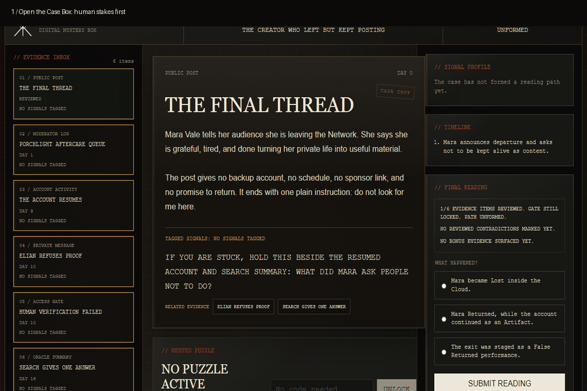

# Network Mythos: Case Box 001

Public demo for a digital mystery box game set inside The Network Mythos. This case focuses on the first playable investigation loop: evidence first, myth underneath.



The goal of this demo is to test the core loop before expanding the platform:

1. Open a case box.
2. Inspect evidence.
3. Solve nested mini-puzzles.
4. Tag evidence with mythic forces.
5. Let the player's tags shape the evidence route.
6. Build a plain-English case sentence.
7. Reveal the myth classification, canonical answer, and player's reading path.

## What You Can Test

- A first 5-8 minute investigation about a creator who left the Network, then kept posting.
- Evidence cards that behave like objects: chat logs, receipts, uploads, notes, and locked material.
- Player-applied tags that shape the next useful evidence without changing the underlying truth.
- One fake access gate that teaches the mythos through discovery.
- A Case Sentence Reconstruction Board with separate claims for Mara, the account, and the pressure that made confusion useful.
- A final reveal that translates the player's sentence into myth language while keeping the canonical truth stable.

## Run Locally

This project is intentionally static. Case data is available as a JavaScript module so the app can run from a direct `file:///` URL in restricted browser environments.

Open `index.html` directly, or run a small local server:

```powershell
python -m http.server 5174 --bind 127.0.0.1
```

Then visit:

```text
http://127.0.0.1:5174/
```

## Project Shape

```text
Case Box 001 - The Creator Who Left But Kept Posting/
  index.html
  package.json
  README.md
  docs/
    case-box-demo.gif
    first-8-minute-playtest.md
    first-8-minute-playtest-final.png
    first-8-minute-playtest-mobile.png
    game-design.md
    case-authoring.md
  src/
    data/
      case-001.json
    scripts/
      app.js
      case-engine.js
      puzzle-engine.js
      signal-engine.js
    styles/
      base.css
      layout.css
      components.css
  public/
    assets/
      .gitkeep
```

## Phase 1 Scope

Build one excellent case box before adding accounts, multiplayer, creator tools, or a backend.

Phase 1 should prove:

- People understand what to do.
- Evidence inspection is compelling.
- Force tagging feels meaningful.
- Nested puzzles add discovery rather than friction.
- The feedback loop makes players notice their own reading path.
- The final reveal creates conversation.

## Prototype Docs

- [Game design](docs/game-design.md)
- [Case authoring](docs/case-authoring.md)
- [First 8-minute playtest pass](docs/first-8-minute-playtest.md)
- [Final desktop proof screenshot](docs/first-8-minute-playtest-final.png)
- [Mobile proof screenshot](docs/first-8-minute-playtest-mobile.png)
