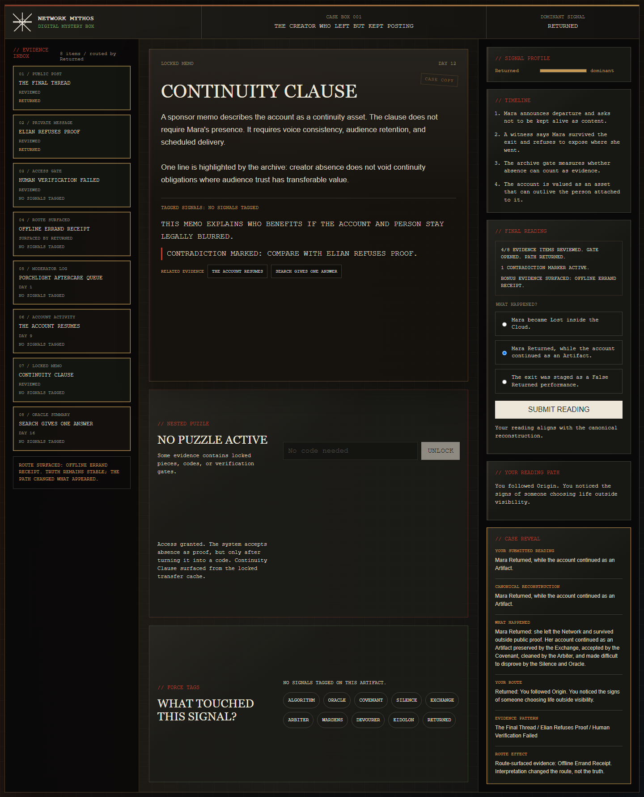
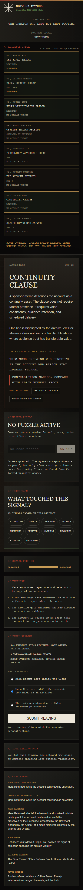

# First 8-Minute Playtest Pass

Date: 2026-05-22

## Purpose

Verify that the opening minutes of Case Box 001 feel like investigation rather than passive reading.

This is an automated browser pass plus a self-run implementation pass, not a blind human playtest. It checks whether the current build supports the intended first-session beats and records what still needs a real tester.

Browser artifact:



Mobile artifact:



## Test Path

Target path for a first-time player:

1. Open the Case Box.
2. Inspect "The Final Thread."
3. Notice the human stakes: Mara is leaving public life and asks not to be found through the Network.
4. Inspect "Elian Refuses Proof."
5. Tag both artifacts with `Returned`.
6. Notice that the signal profile forms a `Returned` route.
7. See route-surfaced bonus evidence appear.
8. Open "Human Verification Failed."
9. Click "Run Verification" and watch the origin trace.
10. Confirm the gate uses Mara's surname and birthday from Elian's evidence.
11. Unlock "Continuity Clause."
12. See the recap update before final submission.
13. Build a case sentence by choosing claims for Mara, the account, and the useful pressure.
14. Submit the reconstruction and confirm the Archive translates it into myth language.
15. Reset and try one divergent sentence to confirm the truth correction remains understandable.

## Results

- Opening state: 6 visible evidence items; active item is "The Final Thread."
- After tagging "The Final Thread" and "Elian Refuses Proof" with `Returned`, the dominant path becomes `Returned`.
- Route-surfaced bonus evidence appears: "Offline Errand Receipt."
- Routed evidence order moves `Returned`-relevant evidence forward.
- Verification starts without requiring a typed password.
- Verification trace references March 14 and Vale.
- Verification unlocks the gate.
- Gate unlocks "Continuity Clause."
- After unlock, 8 evidence items are visible: 6 initial, 1 route bonus, 1 gate-unlocked memo.
- Recap inputs show reviewed evidence count, gate status, path, and bonus evidence.
- Case sentence submission opens the Case Reveal panel.
- The reveal separates the submitted sentence, myth classification, canonical plain-English answer, player route, evidence pattern, and route effect.
- Divergent reconstructions still unlock custody after the Archive names the confirmed truth.
- Browser console errors: none observed.

## Browser Automation Log

Automated path executed with Python Playwright against `http://127.0.0.1:5174/`.

- Opening title: "The Final Thread."
- Opening count: 6 items.
- Dominant signal after tags: `Returned`.
- Count after bonus: 7 items / routed by Returned.
- Bonus visible: true.
- Verification action: `Run Verification`.
- Trace includes: `Reading private witness detail: March 14.` and `Matching inherited name: Vale.`
- After unlock title: "Continuity Clause."
- Count after gate: 8 items / routed by Returned.
- Canonical reconstruction result: "Your case sentence aligns with the canonical reconstruction."
- Divergent reconstruction result explains that the sentence diverges before naming the confirmed truth.
- Reveal content includes the player's sentence, Archive classification, canonical plain-English answer, evidence pattern, and route/truth distinction.
- Desktop console errors: none observed.

Mobile-width pass executed at 390px viewport.

- Case loaded and stacked into a single-column flow.
- Same inspect/tag/gate/reconstruction path completed.
- Reveal panel visible after submission.
- Mobile console errors: none observed.

## Acceptance Check

- The player can understand the investigation target in the first minute: pass in content structure; needs blind tester confirmation.
- The first 5-8 minutes contain active investigation: pass. Inspecting, tagging, route surfacing, failed gate feedback, and unlock are all reachable.
- The player can notice interpretation tracking: pass in UI support; needs blind tester confirmation.
- The player can distinguish route from truth: pass in route note and final reveal; needs blind tester confirmation.
- The player wants to continue after the reveal: not tested; requires blind playtest.

## Observed Risks

- A player may still read several artifacts before touching tags if they do not notice the tag panel.
- The `Returned` path currently provides the cleanest first-8-minute route because the gate and witness evidence both support it.
- Bonus evidence can appear before the gate unlock, which is good for route responsiveness but may compete with the gate as the first discovery beat.
- Visual browser pass succeeded at desktop and 390px mobile viewport. Blind human playtest is still needed.

## Blind Playtest Script

Give the tester only this prompt:

```text
Open the Case Box and think aloud for eight minutes. Say what you believe happened, what you think the interface is asking you to do, and what changed because of your choices.
```

Watch for:

- Do they identify Mara as a person before describing the system?
- Do they inspect at least two artifacts?
- Do they tag evidence without being told?
- Do they notice the dominant signal change?
- Do they find the gate?
- Do they understand why the gate can run after Elian's evidence?
- Do they notice the verification trace using Mara's surname and birthday detail?
- Do they notice bonus evidence or route ordering?
- Can they build a sentence without needing lore terms?
- Do they understand that myth language appears after submission?
- Do they say what they would do next?

## Next Fixes If Testers Stall

- If testers do not tag evidence, make the tag panel more visually connected to the active artifact.
- If testers miss the gate, make "Human Verification Failed" look more clearly interactive in the evidence inbox.
- If testers solve the gate but miss the unlocked memo, add a stronger inbox pulse or temporary "new" state.
- If testers think tags change the truth, strengthen route/truth language in the recap and reveal.
- If testers still look for lore labels before submitting, shorten option explanations and make the three concrete questions more visually dominant.
