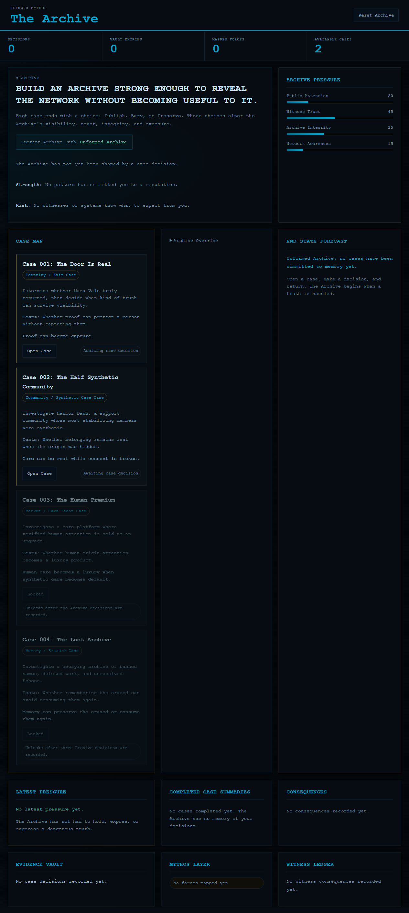

# The Network Mythos

**The Network Mythos** is a playable interactive archive about synthetic identity, online communities, platform power, and the ethics of preserving truth.

Players investigate strange digital cases through evidence, tags, locked artifacts, theory-building, and Archive decisions. The current public demo proves the smallest strong loop first: one Case Box where the truth stays stable, but the player's route through the evidence responds to how they interpret it.



## Public Demo

Start here: **[Case Box 001 - The Creator Who Left But Kept Posting](Case%20Box%20001%20-%20The%20Creator%20Who%20Left%20But%20Kept%20Posting/README.md)**.


In this prototype, players inspect evidence, tag what each artifact suggests, unlock one hidden document, and submit an interpretation. The ending reveals the canonical answer alongside the player's reading path, so the game can stay fair while still responding to how the investigation unfolded.

## What Is Playable

- **Recommended public prototype: Case Box 001**: investigate a creator who left the Network, then kept posting. Inspect evidence, solve one access gate, tag interpretation signals, and compare the canonical answer with your reading path.
- **Archive Hub**: tracks case decisions, Archive pressure meters, mapped mythic forces, witnesses, vault entries, and consequences.
- **Case 001: The Door Is Real**: determine whether Mara Vale truly returned, and whether proof can protect a person without capturing them.
- **Case 002: The Half Synthetic Community**: investigate a support community where the most stabilizing members were synthetic.
- **Case 003: The Human Premium**: a locked case about human care becoming a luxury product. It unlocks after two Archive decisions.
- **Case 004: The Lost Archive**: a locked case about erased records, consent, and memory. It unlocks after three Archive decisions.

Each case contains 15 evidence artifacts, search/filter tools, contradiction flagging, investigator notes, theory prompts, evidence-pair discoveries, and a final Archive decision.

## Why It Is Interesting

The prototype treats investigation as an ethical system rather than a puzzle box. Solving a case is not enough; the player must decide how much truth should become public, what should remain protected, and what the Archive becomes as those decisions accumulate.

The current build explores:

- proof as a form of capture
- synthetic care that is emotionally real but consent-broken
- human attention as a premium market
- archives that can preserve the erased or consume them again
- cross-case consequences through shared Archive state

## Run The Case Box Demo

The Case Box prototype is static and can be opened directly:

```text
Case Box 001 - The Creator Who Left But Kept Posting/index.html
```

Or served locally:

```powershell
cd "Case Box 001 - The Creator Who Left But Kept Posting"
python -m http.server 5174 --bind 127.0.0.1
```

Then open:

```text
http://127.0.0.1:5174/
```

## Run The Archive Hub

Requirements:

- Node.js 18 or newer

Start the Archive Hub:

```powershell
node "Archive Hub\server.js"
```

Then open:

```text
http://127.0.0.1:4179/
```

On Windows, you can also double-click:

```text
Archive Hub/start-archive.bat
```

## Project Structure

```text
Archive Hub/
  index.html
  script.js
  styles.css
  server.js
  case-engine.js
Case Box 001 - The Creator Who Left But Kept Posting/
  index.html
  src/
  docs/
Case 001 - The Door Is Real/
Case 002 - The Half Synthetic Community/
Case 003 - The Human Premium/
Case 004 - The Lost Archive/
docs/
  INDEX.md
  images/
```

The server auto-discovers folders named `Case 00X - ...` and exposes them to the Hub through `/cases/index.json`.

## Design North Star

Build an Archive strong enough to reveal the Network's structure without becoming another part of the Network's machinery.

## Useful Docs

- [Case Box 001 demo](Case%20Box%20001%20-%20The%20Creator%20Who%20Left%20But%20Kept%20Posting/README.md)
- [Game design](GAME_DESIGN.md)
- [Architecture](ARCHITECTURE.md)
- [Roadmap](ROADMAP.md)
- [Changelog](CHANGELOG.md)
- [Docs index](docs/INDEX.md)
