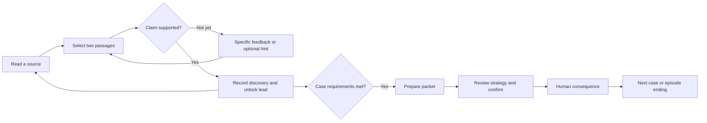
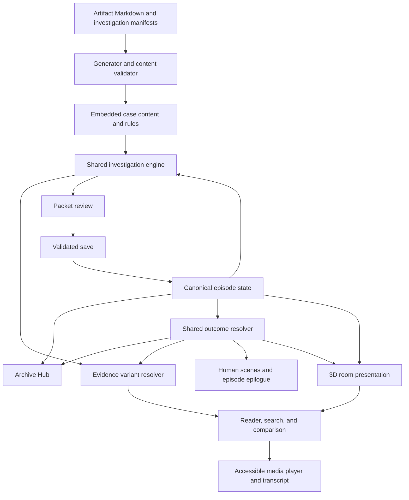
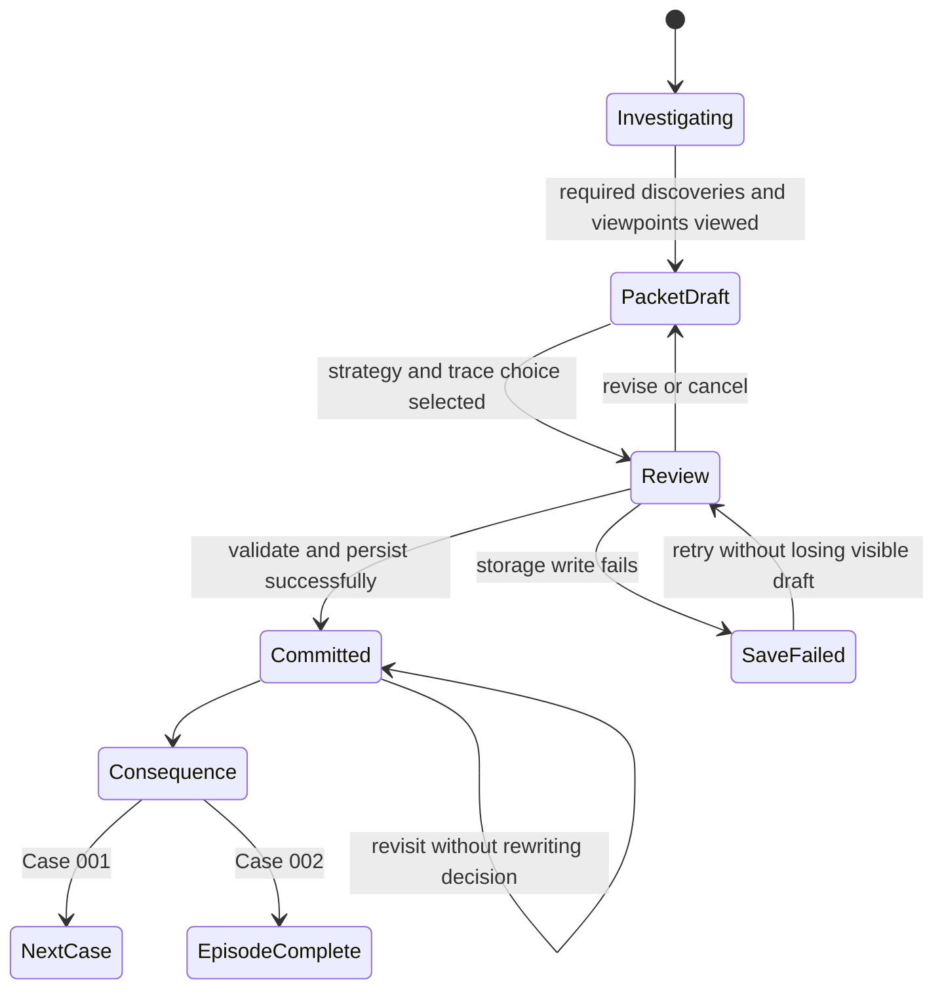
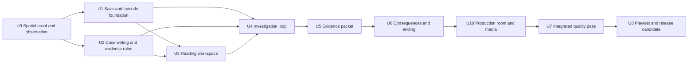

# The Network Mythos: The Cost of Proof — 3D Archive - Plan

## Goal Capsule

**Objective:** Players finish a two-case investigation feeling that they uncovered the truth themselves, then made a difficult decision that visibly changed other people's lives.

**Means:** Place the Mara Vale and Harbor Dawn investigations inside a small 3D Archive, using contemporary media, authored evidence connections, prepared packets, and consequences carried between cases (KTD1–KTD4, KTD9–KTD10).

**Working title:** *The Cost of Proof*. This is an episode label, not an established release number.

**Authority:** The user's later decisions take precedence. Within this plan, requirements own player behavior; technical decisions own implementation; build units execute both. Earlier roadmaps remain background where they conflict with this version's scope.

**Execution boundary:** This document plans the work. Implementation, publishing, and player recruitment have not been performed or authorized by this planning request. A later implementation should stop at a verified release candidate unless separately authorized to publish.

**Stop conditions:** Do not call the version ready while a player can bypass deductions, lose a confirmed decision, get trapped by a consequence, or finish without seeing a human outcome.

---

## Product Contract

### Summary

Build one complete episode from **Case 001: The Door Is Real** and **Case 002: The Half Synthetic Community**, entered through an explorable 3D Archive room. Keep the unsettling Archive identity and the existing 15 artifacts per case. Adapt selected artifacts into voice messages, short vertical videos, memes, and message threads. Make each format support investigation: identify evidence, connect sources, establish a claim, then decide how the evidence should be held.

Begin with a 10–15 minute spatial proof using five artifacts from Mara's case. Test entering the room, inspecting a phone and terminal, making the first deduction, and seeing a sample consequence. Expand into the full episode only after that experience is understandable and comfortable.

The episode should take approximately **45–60 minutes** for a first-time reader. This is a playtest target, not a promised duration. Finish Harbor Dawn with a personal epilogue that also reflects what happened to Mara's case.

### Problem Frame

The prototype has strong human stakes and a coherent theme: proof can cause harm, and care can matter even when consent is broken. Its interaction rules do not yet carry that weight.

In the reviewed build, flagging one designated artifact awarded an evidence pair without opening its supposed companions. Case 001's ending became available after four of fifteen artifacts, with an empty theory. The generic meter changes also make Preserve look consistently attractive. These were findings from a targeted playthrough and source inspection, not a study of new players.

The opening explains the moral framework early. Many artifacts share the same polished voice. The dense, low-contrast workspace makes close reading harder than it needs to be. Together, these weaken the feeling of discovering something independently.

### Planning assumptions

This plan adopts the recommended two-case scope from the review and the user's subsequent interest in 3D, voice messages, short videos, and memes. A compact 3D room with readable media overlays is the recommended approach. The user requested advice on the best approach; free movement, visual style, and exact mechanics below are proposals, not previously approved choices.

The target player enjoys thoughtful browser-based mysteries and can read at their own pace. The version remains a solo, locally saved experience. Cases 003 and 004 remain in the repository as earlier prototypes, outside the episode's navigation and completion count.

### Requirements

#### Investigation and pacing

- R1. Present a complete two-case episode with a clear beginning, continuation, and ending; Case 002 becomes playable after a committed Case 001 decision.
- R2. Open with Mara's apparent return and a concrete personal question before explaining the Network's philosophy; introduce controls through the first evidence connection.
- R3. Require three authored discoveries per case, each backed by passages from two distinct artifacts and a defensible selected claim; uncertainty must remain distinguishable from proof.
- R4. Unlock evidence through completed discoveries, with progress remaining unlocked after navigation or search changes; opening files, flagging them, or typing a keyword must not substitute for a discovery.
- R5. Provide optional notes, bookmarks, and three levels of hints—where to look, what relationship to examine, and an explanation of the answer; using hints carries no narrative penalty.

#### Decisions and consequences

- R6. Let the player review a three-part evidence packet and choose whether to include its defined personal traces; this choice changes the prepared packet, not the underlying source documents.
- R7. Offer Publish, Bury, and Preserve with a stated audience, one concrete expected benefit, one cost, and remaining uncertainty; commit only after a separate, accessible confirmation.
- R8. Give each strategy and personal-trace combination a case-specific result, and carry Case 001's result into Case 002's evidence access and witness response; every route must remain completable.
- R9. Show a human consequence after each decision and a combined epilogue after Case 002; do not designate a best ending or reward Preserve with universally superior scores.

#### Presentation and continuity

- R10. Give artifacts distinct voices and document forms while retaining their evidentiary meaning; move final interpretations out of the opening and into discoveries or optional post-case reflection.
- R11. Support comfortable reading, comparison, keyboard use, and narrow screens; offer a quiet display mode that disables CRT motion and distortion without hiding evidence.
- R12. Save discoveries, notes, drafts, and committed decisions reliably on the shared origin; report save failures honestly and prevent casual overwriting of a completed case.
- R13. Keep earlier prototype saves intact and separate from this episode; a confirmed new-episode action resets only this version's run.
- R14. Keep all fictional evidence handling inside the game; choices must not send messages, publish documents, or expose player notes to an external service.

#### Spatial experience and media

- R15. Let the player explore one 3D Archive room through a phone station, terminal, and evidence wall; use click/tap-to-approach stations with keyboard equivalents and instant movement in quiet mode.
- R16. Adapt six existing artifacts into the defined media set with playable controls, captions or transcripts, and selectable evidence references; changing presentation must not add new mandatory deductions.
- R17. Make committed outcomes visibly change the Archive's objects and messages, with a text description of each meaningful change available in the case history.
- R18. Keep every investigation action and all clues available in a desk view when 3D is disabled, unsupported, or fails; switching views must retain the same progress and evidence rules.

### Player flow

F1 covers R1–R5 and R15–R16: enter the Archive → inspect Mara's returned post on the phone → approach the terminal's summary and verification report → connect two passages → identify what verification does and does not establish → receive the next lead.

F2 covers R6–R9 and R12: complete the required discoveries → review the packet → choose personal-trace handling → compare strategies → inspect the final preview → confirm → see the human response → return to the changed Archive.

F3 covers R1, R8, R9, and R12: continue into Harbor Dawn → encounter the effect of the earlier choice → investigate through an available evidence route → make the second decision → read the combined epilogue → revisit completed evidence or start a new episode.

### Case blueprint

Artifact numbers refer to the existing files. The table specifies new interaction rules, not claims that these rules already exist.

| Discovery | Required sources | Supported conclusion | Opens |
|---|---|---|---|
| C1-D1: Verified account, uncertain person | 04 AI summary + 09 verification report | Account continuity does not establish who operates it now. | 06–08, including the two voice records |
| C1-D2: A change worth investigating | 07 old interview + 08 new voice | The changed account is grounds for further inquiry, not proof of a synthetic replacement. | 10–13, including testimony and the invoice |
| C1-D3: A commissioned reconstruction | 09 verification report + 13 synthetic invoice | A continuity service used archived material to construct the return; Mara's location remains a separate question. | 14 location clue and packet preparation |
| C2-D1: Help with a real recipient | 03 check-in thread + 04 Aya testimony | Aya describes a concrete benefit from the support; the helper's identity does not erase that account. | 06–09, including deployment evidence |
| C2-D2: Undisclosed deployment | 08 care scripts + 09 deployment memo or its recovery variant | Synthetic support was deployed without meaningful disclosure to members. | 10–13, including the liability brief |
| C2-D3: Support used to redirect blame | 08 care scripts + 11 liability brief | The contractor also used care language to steer attention away from institutional liability. | 14 consent proposal and packet preparation |

For Case 001, make artifact 09 available at the opening as an enclosed verification report alongside 01–05. Highlight only the returned post, summary, and report as starting leads. After the three discoveries, require the player to open the human-stakes evidence in 10 and 14 before preparation.

For Case 002, begin with 01–05. After the three discoveries, require 12 and 14 to have been opened before preparation. Opening is recorded as **viewed**, not proof that the player read or understood the document.

Artifact 15 becomes the reconstruction assembled from the player's discoveries. Do not expose a finished answer before the required reasoning. All other artifacts remain available as context once unlocked. No optional discovery is required in this version; the six required discoveries are the content budget.

Each discovery uses two selected, authored passages and two or three plausible claim choices. Feedback explains what is missing or overstated. Do not score free-text notes, equate polished speech with synthetic identity, or award progress for a meaningless pair.

### The evidence packet

Each case has three cards: **what the institution did**, **the affected person's account**, and **personal traces**. The first two stay in the packet. The player controls one binary choice: **include personal traces** or **remove personal traces**. Start with neither selected so the player makes the decision consciously.

| Case | Personal traces controlled by the choice | Benefit of inclusion | Cost of inclusion |
|---|---|---|---|
| Mara | The nonpublic location and contact clues in artifact 14 | Another investigator can independently follow the route. | The prepared record can make Mara and a third party easier to locate. |
| Harbor Dawn | Aya's identifying details and attributable private excerpt | Her testimony can be independently attributed and followed up. | A vulnerable member becomes identifiable within the packet's audience. |

Removing these traces preserves the institutional evidence and an anonymized account. It limits independent personal follow-up; it must not magically invalidate the contractor evidence.

| Strategy | Who receives the prepared packet in the fiction? | Immediate purpose | Inherent cost |
|---|---|---|---|
| Publish | The public, immediately | Make institutional conduct contestable in public. | Lose control of onward circulation and interpretation. |
| Bury | The player's sealed Archive only; no new recipients | Withhold the case from circulation now. | Affected people and the public cannot use the evidence to challenge the official account. |
| Preserve | A restricted Archive with affected people given first access | Keep context available while people decide how to engage. | The Archive controls access and delays public accountability. |

The trace choice affects the packet under all three strategies. A sealed packet with identifiers still creates a custody responsibility. A restricted packet with identifiers still exposes them to its permitted audience. The preview must describe that actual audience, rather than implying every strategy publishes.

KTD3 bounds this to six outcomes per case. Do not add independent audiences, per-card redaction toggles, adjustable delay sliders, or extra ending choices.

### Consequences to author

These are proposed scenes and evidence variants. They extend the existing writing.

| Case decision | Concrete benefit shown | Concrete cost shown |
|---|---|---|
| Mara: Publish | A public challenge to the continuity vendor receives corroboration. | The Harbor Dawn deployment original disappears; recover a procurement copy instead. |
| Mara: Bury | Elian responds to the restraint and a witness supplies the original memo privately. | The official account hardens while the evidence remains unavailable to challenge it. |
| Mara: Preserve | Affected people can inspect the evidence with context; the original memo remains reachable. | A delay gives the vendor time to restate its continuity claim as accepted fact. |
| Harbor Dawn: Publish | Members can identify and contest the undisclosed deployment. | Some encounter the revelation through public reaction before they choose to read it. |
| Harbor Dawn: Bury | Members are spared an imposed public revelation. | Members seeking an explanation remain excluded, and the contractor retains its account. |
| Harbor Dawn: Preserve | Members can approach their records with context and some control. | An accountability opportunity passes while access remains restricted. |

Within each row, included traces permit attribution or follow-up and create a named exposure/custody consequence. Removed traces protect that boundary and leave a follow-up request unresolved. These are concrete scene differences, not a universal good/bad modifier.

Case 002 opens with the changed evidence route plus one witness message reflecting both parts of Case 001's decision. On the Publish route, a clearly signposted procurement lead retrieves the alternate artifact 09 without requiring the missing original. Its retained deployment and disclosure clauses support C2-D2. Missing personal context remains unavailable. Witness variants must never withhold the only evidence for a required discovery.

The final epilogue has three short parts: Mara/Elian, Aya/the community, and the Archive's remaining responsibility. Assemble it from authored case outcomes, with a combined closing sentence. Do not write 36 separate full endings or use generic meter totals as the ending.

### Reading and visual direction

Retain the dark Archive frame, restrained signal colors, and unease. Give the evidence itself room to breathe. The opening should lead with a person and one actionable lead; move meters and long world explanations behind the immediate task.

Use a primary reading pane, an evidence list, and an on-demand comparison tray. On narrow screens, stack the two selected excerpts and return focus to the source when closing comparison. Keep notes optional and out of the main reading path.

Use three reusable document treatments: personal messages, public threads/posts, and institutional records. Distinguish them through authorship, dates, spacing, and voice. A private message can hesitate or omit context; a contract can hide responsibility in narrow wording. Avoid putting a polished thesis statement in every artifact.

For R11, use scalable body text, visible focus, named controls, and status announcements. Normal text must reach 4.5:1 contrast; large text 3:1, following [W3C's contrast criterion](https://www.w3.org/WAI/WCAG22/Understanding/contrast-minimum.html). Check widths of 320, 390, and 1280 CSS pixels and 200% zoom. Respect reduced-motion preferences and make quiet mode available before the first artifact. Sound must be optional and never carry an exclusive clue.

### How the 3D experience should work

Use a stylized, lived-in records room: worn surfaces, a personal phone, an institutional terminal, drawers, and an evidence wall. Controlled lighting and a few purposeful objects are enough to establish atmosphere. Avoid turning every surface into a glowing interface.

| Place | Player action | Investigation purpose |
|---|---|---|
| Phone station | Open voice notes, a vertical clip, comments, and a shared meme. | Encounter personal relationships and the circulating version of the story. |
| Terminal | Search accessible records and compare the verification report with the public summary. | Test a claim against its source. |
| Evidence wall | Revisit established connections and assemble the packet. | See what is supported, what remains uncertain, and who may be exposed. |

Clicking or tapping a labeled station moves the viewpoint to it. A persistent station list provides the same navigation through ordinary buttons. Provide a no-motion option, obvious Back control, and a direct way to reopen evidence already found. Do not require repeated walking to compare two sources. Continuous first-person movement, jumping, inventory physics, and external locations are deferred.

Open media and long documents in a stable, readable overlay. A phone should feel like an object in the room, but the player should not need to squint at text on a distant 3D screen. Closing the overlay returns focus to the station. The evidence wall uses the same connection rules as the desk view.

The room should remember decisions. Publish can leave the terminal displaying public copies and a missing-source notice. Bury can leave a sealed case tray while the public feed continues with the official account. Preserve can leave a restricted record alongside waiting access requests. Personal-trace handling changes the packet label and the associated human message. These are projections of existing outcome facts, not additional ending branches.

### Media as evidence

Create a fictional short-video service with familiar vertical clips, creator handles, captions, comments, and repost history. Author and serve the clips with the game. Use a finite evidence feed; no live TikTok account, login, or infinite scrolling is required.

| Existing artifact to adapt | Format | What the player investigates |
|---|---|---|
| Case 001 / 05 returned post | A 20–40 second vertical video | What the account claims, what it omits, and how viewers interpret it. |
| Case 001 / 07 old interview | A 30–60 second audio excerpt | An earlier statement in context, with a transcript supporting C1-D2. |
| Case 001 / 06 comments | A meme and its surrounding repost thread | How a cropped joke or image changes the public story; a meme is evidence of circulation, not automatic proof of the underlying claim. |
| Case 001 / 10 sibling message | A 30–60 second voice note from Elian | The personal cost of treating a loved one's disappearance as public material. |
| Case 002 / 03 check-in | A navigable group-message thread | Who responded to whom and what help was described. |
| Case 002 / 04 Aya testimony | A 30–60 second voice note | Aya's concrete experience of care and her position on disclosure. |

All other artifacts retain their existing evidence function with the improved document treatments. Keep these six adaptations inside the 30-artifact budget. Proposed durations are authoring limits to test, not obligations to stretch content.

Let the player pause, scrub, replay, read a transcript, and pin an authored timestamp or passage. A visually significant crop or frame needs an equivalent description available at the same stage. Captions must preserve relevant non-speech clues. Playback completion never counts as a solved discovery.

Every media artifact needs a creator, an intended audience, and a reason it exists. Give a meme a community-specific joke or reused image; give a voice note interruptions and a relationship; give a short clip an intended impression. Do not make every format deliver the same exposition or make every recording secretly fake.

Use original fictional performances, graphics, and footage, with documented rights for any licensed assets. One actor can record multiple small clips if the voices remain distinguishable. Temporary voices and simple video compositions are acceptable for the proof; final media quality needs a separate editorial listen/watch pass.

### Acceptance examples

- AE1 covers R3–R4: Flagging artifact 04 alone records a bookmark, awards no discovery, and opens no new tier. Pairing its claim with artifact 09's limitation and selecting the supported conclusion completes C1-D1 once.
- AE2 covers R4–R5: Clearing search cannot remove an earned lead. A hint-assisted discovery persists after reload and has the same narrative access as an unassisted one.
- AE3 covers R6–R8: Publish with removed traces shows an anonymized packet and a public audience. Publish with included traces shows the personal material and its exposure cost before confirmation.
- AE4 covers R8: After Mara's Publish outcome, the original deployment memo is unavailable in both reading and search. The procurement lead supplies an alternate route to C2-D2 and the case remains completable.
- AE5 covers R7 and R12: Clicking a strategy opens review without committing. One confirmation records one decision; reloading, double-clicking, or revisiting does not apply it again.
- AE6 covers R12–R13: An existing prototype save survives starting this episode. A failed browser save leaves the draft visible, reports failure, and does not claim that the case is complete.
- AE7 covers R15 and R18: A keyboard user opens the phone through the station list, reads the same evidence, and switches to desk view without changing discovery status.
- AE8 covers R16: A player who cannot play Elian's voice note can use its transcript, select the same evidence, and reach the same decision. A paused clip resumes only when requested.
- AE9 covers R17: Reloading after Publish restores the changed terminal and matching history entry. The room does not replay or recommit the choice.

### Scope boundaries

This release includes one 3D room, three stations, the existing 30 artifacts with the six media adaptations, the six discoveries above, packet preparation, twelve case outcomes, the combined epilogue, and the reading/accessibility pass.

Defer adapting Cases 003–004, additional cases, optional deduction chains, fully voiced dialogue, a bespoke soundtrack, elaborate animations, free-roaming exterior environments, and a mobile-specific redesign. Outside this version are accounts, cloud saves, multiplayer, generative dialogue, procedural mysteries, paid features, a UI-framework rewrite, live social-platform integrations, and a public hosting migration.

No additional product choice blocks starting the proposed spatial proof. Its observation gate determines whether the 3D presentation is ready to expand; it must not be treated as validated in advance. Final dialogue wording, scene lengths, and the episode's public title can be refined during writing. The release date and publishing destination remain outside this plan.

---

## Planning Contract

### Key Technical Decisions

- KTD1. Keep the current static browser architecture and shared-origin Node server (R1, R12). Add a versioned investigation mode for Cases 001–002 so the existing Case 003–004 configurations keep using their legacy behavior. This limits the change to the episode instead of forcing a four-case conversion.
- KTD2. Represent discoveries as authored passage references, accepted source pairs, claim IDs, and prerequisites (R3–R5). Validate those rules deterministically. This supports meaningful evidence use without unreliable language-model grading or arbitrary text matching.
- KTD3. Store one strategy and one trace choice per committed case (R6–R9). Six local outcomes per case produce 36 ordered two-case combinations. Evidence routes depend on Case 001's committed outcome; the epilogue combines authored fragments. This is the branching budget.
- KTD4. Resolve evidence variants before rendering or searching them (R8). Replace the v2 path's side-effecting `onOpenEvidence` hook with a returned content/availability result. The current engine coerces a `null` replacement signal to an empty string, allowing the normal memo to overwrite the intended missing-file notice.
- KTD5. Use one canonical episode state under `network.archive.v2` (R12–R13), shared by the Hub and both cases. Keep legacy keys untouched; do not convert old read/flag counts into solved discoveries. Browser storage is origin-specific and can fail, so retain the unified origin and handle errors as specified below. See [MDN on localStorage](https://developer.mozilla.org/en-US/docs/Web/API/Window/localStorage).
- KTD6. Keep artifact Markdown as the prose/transcript source and generate embedded browser data from it (R10, R16). Put stable passage definitions, timestamps, media references, and discovery recipes in one authored investigation manifest per case. A generator validates references against the Markdown and emits the browser data; do not manually maintain a second copy of passage text.
- KTD7. Use Node's built-in test runner for rules and content validation, plus Playwright as a development-only browser-test dependency (R1–R18). Introduce documented scripts because the current repository has no package test contract. Add no UI framework; Three.js is the rendering dependency specified by KTD9. Check the current supported runtime when pinning the toolchain, following [Playwright's installation guidance](https://playwright.dev/docs/intro).
- KTD8. Replace v2's duplicated numerical outcome updates with shared, case-specific outcome facts (R9, R12). The Hub may retain Public Attention, Witness Trust, Archive Integrity, and Network Awareness as secondary descriptive statuses, derived from committed outcomes rather than additive scores.
- KTD9. Add Three.js as a lazy-loaded presentation layer on the existing browser game (R15, R17–R18). Keep rules and saved state outside the renderer, and use HTML for accessible media controls and reading. This reuses the current JavaScript content architecture without an engine migration. Three.js supports browser scenes, cameras, geometry, lighting, and textures; see its [fundamentals](https://threejs.org/manual/en/fundamentals.html). Bundle a pinned local dependency for the scene; do not depend on a third-party CDN at play time.
- KTD10. Serve authored media locally with standard HTML audio/video and image elements (R14, R16). Add correct media MIME types and byte-range responses to the existing server for dependable scrubbing, with tests for missing and invalid ranges. Use WebVTT captions and authored transcripts, following [MDN's caption guidance](https://developer.mozilla.org/en-US/docs/Web/Media/Guides/Audio_and_video_delivery/Adding_captions_and_subtitles_to_HTML5_video). Start playback on a player's action and show a Play control if it is blocked; browsers restrict some autoplay, as described in [MDN's autoplay guide](https://developer.mozilla.org/en-US/docs/Web/Media/Guides/Autoplay).

### High-Level Technical Design

These sketches show responsibilities and constraints. Exact helper names may change during implementation.

The canonical state contains schema/content versions, a run ID, a revision, per-case viewed IDs, selections, discoveries, hint use, notes, packet drafts, and committed decisions in chronological sequence. Store identifiers and player text, not duplicated artifact bodies. Search text and open panels are display state, never progress authority.

**Presentation lifecycle, per KTD9:** Entry → load the room with a visible desk-view option → approach a station → open its HTML evidence overlay → close back to the station. Keep only one active media player. Pause it on closing, navigation, or tab hiding. Stop the renderer while hidden and dispose of scene resources on exit. If graphics initialization, asset loading, or context restoration fails, keep the HTML experience available and explain the switch.

**Media contract, per KTD6/KTD10:** Each rich artifact supplies its kind, local source, poster or image description, transcript, captions where applicable, and authored evidence ranges. A missing or unsupported media file shows its accessible transcript/description and Retry. Search indexes only the resolved available variant's transcript. All evidence IDs remain stable across desk and 3D views.

**Save lifecycle, per KTD5:** Validate loaded data and recognized IDs. Persist discoveries and edits as they occur, with a short debounce for notes. A commit validates prerequisites again and writes the decision with its packet snapshot before displaying success or enabling continuation. A completed case permits reading and notes but no replacement decision within that run.

On quota or storage-access failure, keep the current draft in memory on the current page, show a persistent warning, and offer Retry. Explain that leaving or reloading may lose unsaved work. Do not enable the next case using an unpersisted decision. This is not a cross-page memory fallback.

If data is malformed or has an unsupported schema/content version, preserve it and offer an explicitly confirmed new episode. Back up the existing raw v2 value to a recovery key before replacing it; abort replacement if that backup cannot be saved. Never call `localStorage.clear()`. Start-new confirmation states that the current episode's progress will reset. Earlier prototype saves and unrelated storage remain untouched.

Support one editing tab per episode. Re-read the revision before saving and watch storage changes from another tab; suspend stale editing and ask the player to reload rather than knowingly overwrite newer progress. Simultaneous multi-tab editing is outside scope; this revision check is not a transaction guarantee.

**Evidence lifecycle, per KTD2/KTD4:** Resolve outcome-specific availability, then derive the reader body, search index, comparison passages, and available leads from that result. A missing-file view must provide its recovery lead. Revealed leads remain recorded. Client-side fictional secrecy is not a security boundary; no encryption system is needed.

**Episode boundary, per KTD1:** Mark the new mode explicitly in the first two case configurations. Add episode membership to case metadata and make the Hub filter navigation, unlock counts, and completion totals accordingly. A direct Case 002 URL shows its prerequisite and a return link until Case 001 is committed. Legacy Case 003–004 routes show an earlier-prototype label and must not write v2 progress.

**Authoring contract, per KTD6:** Validate unique IDs, passage existence, valid claims, acyclic prerequisites, all required discoveries reachable in every applicable outcome, and complete packet/outcome definitions. The alternate memo has its own passage IDs accepted by C2-D2. Rebuilding content twice without source changes must produce no diff.

### Build sequence

Start with U9's spatial proof, then build the episode. U1–U6 may proceed once the proof is technically usable; U10 additionally requires U9's player-observation gate. U4 still verifies the first Mara discovery in the production rules. Do not expand art or media production while the proof's interaction or comfort gate fails.

---

## Implementation Units

File paths below are repository-relative. New files are marked **new**; directory references mean only the relevant files in that directory.

| Unit | Work | Primary files | Depends on |
|---|---|---|---|
| U9 | Spatial proof | `prototypes/archive-3d/` | None |
| U1 | Save and episode foundation | Hub, episode state/rules | U9 technical proof |
| U2 | Evidence and media authoring | Both cases' artifacts/manifests | U9 technical proof |
| U3 | Reading workspace | HTML, CSS, shared UI | U1, U2 |
| U4 | Discoveries | Shared engine and rules | U1–U3 |
| U5 | Packet confirmation | Shared UI and state | U4 |
| U6 | Outcomes | Outcome resolver and Hub | U5 |
| U10 | Production 3D and media | Room, media player, server | U3, U6 |
| U7 | Integrated quality | Changed files, tests, docs | U10 |
| U8 | Player validation | Playtest records | U7 |

### U1. Establish the episode and save contract

**Goal:** Start, resume, and complete cases without confusing legacy progress.

**Requirements:** R1, R12–R14; KTD1, KTD5, KTD8. **Depends on:** U9's technical proof; observation gate applies to U10.

**Files:** `Archive Hub/script.js`, `Archive Hub/server.js`, both cases' `case-data.json`; **new** `Archive Hub/episode-state.js`, `Archive Hub/episode-rules.js`, `package.json`, `tests/episode-state.test.js`.

**Approach:** Add versioned state validation and pure progress rules. Wire the Hub to episode membership. Capture the old-save boundary before changing writes. Establish the test command without adding runtime packages.

**Test scenarios:** Fresh start, reload after partial progress, direct locked Case 002 entry, duplicate commit, blocked/quota-limited storage, malformed/future-version save, revision changed by another tab, confirmed reset with legacy and unrelated keys present.

**Verification:** State tests pass; AE5–AE6 pass at the state boundary; no legacy key changes and no new case completion on a failed write.

### U2. Author the evidence and consequence specifications

**Goal:** Make both cases support the proposed reasoning and human outcomes before wiring every screen.

**Requirements:** R2–R10, R16; KTD2–KTD4, KTD6. **Depends on:** U9's technical proof; observation gate applies to U10.

**Files:** Both cases' `artifacts/`, `case-design.md`, `artifact-manifest.md`, and `prototype/case-config.js`; **new** one `investigation.json` per case, `scripts/build-case-content.js`, `tests/content.test.js`.

**Approach:** Write the six recipes, passage IDs, three-card packets, twelve local outcomes, witness variants, procurement recovery lead, and epilogue fragments. Script the defined media adaptations and prepare a shot/recording list with caption text and asset-rights notes. Revise artifact voices. Generate each `prototype/artifacts-data.js` and a companion `prototype/investigation-data.js`. Leave the required 15 main artifacts intact; the recovered memo is a variant of 09.

**Test scenarios:** Missing passage, duplicate ID, cyclic unlock, wrong source accepted as proof, absent alternate-memo path, incomplete outcome, generated text drifting from Markdown.

**Verification:** Content validation covers every authored route. A manual evidence audit confirms each accepted claim says no more than its sources support. A second build produces no changes.

### U3. Build the opening and reading workspace

**Goal:** Make entering the mystery, reading, and selecting evidence comfortable.

**Requirements:** R2, R5, R10–R11; KTD1. **Depends on:** U1, U2.

**Files:** `Archive Hub/index.html`, `Archive Hub/styles.css`, `Archive Hub/script.js`; both cases' `prototype/index.html` and `prototype/styles.css`; **new** `Archive Hub/investigation-ui.js`, `tests/browser/reading.spec.js`.

**Approach:** Lead with Mara and the first question. Add document treatments, a comparison tray, notes, quiet mode, and visible save/lead feedback. Share behavior between the two case shells. Keep all controls semantic and operable without dragging.

**Test scenarios:** Keyboard passage selection and tray closure, stacked mobile comparison, 200% zoom, reduced motion, quiet mode before first reading, returning to the source after comparing.

**Verification:** R11's viewport and contrast checks pass; focus and reading order remain usable. No newly required asset is missing or needed to understand a clue.

### U4. Make discoveries drive progression

**Goal:** Replace flag-count progression with the evidence loop.

**Requirements:** R3–R5; KTD2, KTD4–KTD6. **Depends on:** U1–U3.

**Files:** `Archive Hub/case-engine.js`, `Archive Hub/episode-rules.js`, `Archive Hub/investigation-ui.js`, both case configurations; **new** `tests/investigation.test.js`, `tests/browser/investigation.spec.js`.

**Approach:** Mount the new mode only for the episode. Render selectable passages and claim choices; award discoveries once. Derive gates from completed discoveries and the required viewed artifacts. Turn old flags into bookmarks in this mode. Add layered hints and the player-built reconstruction.

**Test scenarios:** AE1–AE2; swapped passage order; two passages from the same artifact; wrong or overstated claim; repeated correct answer; hint-assisted reload; keyword-only attempt to unlock evidence; empty notes with otherwise valid work.

**Verification:** Each case's exact three-step path works. No read-count, search, flag, or direct DOM action bypasses the rule validation. Observe a first-time player attempt C1-D1 before moving to full consequence polish.

### U5. Build packet preparation and confirmation

**Goal:** Make the ending decision understandable and intentional.

**Requirements:** R6–R7, R12, R14; KTD3, KTD5. **Depends on:** U4.

**Files:** Shared engine/UI/state modules, both case shells; **new** `tests/decisions.test.js`, `tests/browser/packet.spec.js`.

**Approach:** Show the three cards, trace choice, strategy audience, and benefit/cost preview. Replace the current click/hold ending behavior with review followed by a normal Confirm button. Lock committed decisions for this run and offer return-to-evidence before confirmation.

**Test scenarios:** AE3 and AE5–AE6; all six combinations per case; cancel and revise; no trace choice; missing prerequisite; touch/keyboard confirmation; double activation; storage failure during confirmation.

**Verification:** No single strategy click commits. The displayed audience and packet match the saved snapshot. One committed decision produces one outcome.

### U6. Connect consequences, evidence routes, and the episode ending

**Goal:** Let players encounter the cost and value of their decisions.

**Requirements:** R1, R8–R9; KTD3–KTD4, KTD8. **Depends on:** U5.

**Files:** Hub script, engine, both case configurations, generated content; **new** `Archive Hub/episode-outcomes.js`, `tests/consequences.test.js`, `tests/browser/episode.spec.js`.

**Approach:** Resolve the authored local outcome once from each committed packet. Use it for witness scenes, available evidence, secondary Archive statuses, and chronological case history. Connect the alternate memo route and assemble the three-part epilogue.

**Test scenarios:** AE4; all 36 ordered outcome combinations; missing original absent from search and comparison; alternate route reload; trace handling changing the witness/epilogue detail; correct latest event regardless of catalog order; revisit without repeated effects.

**Verification:** Every combination reaches an ending in rules tests. Full browser paths exercise all three Case 001 strategies and both trace settings, with at least one complete two-case playthrough per strategy.

### U7. Finish the integrated experience

**Goal:** Remove release-blocking friction and misleading leftovers.

**Requirements:** R1–R18. **Depends on:** U10.

**Files:** Files changed by U1–U6 and U10 as needed; browser tests; both cases' `playtest/playtest-checklist.md`; `README.md`, `ARCHITECTURE.md`, `PROJECT_HANDOFF.md`, `RELEASE_READINESS_PLAN.md`, `ROADMAP.md`, `ULTIMATE_ROADMAP.md`, `docs/INDEX.md`.

**Approach:** Run the verification contract, inspect story continuity and readability, remove obsolete v2 controls and unresolved media requests, and document the new modes. Mark older release sequencing and completed-feature claims as superseded where they conflict. Keep unfinished future work visibly separate from implemented behavior.

**Test scenarios:** Fresh episode through epilogue; reload in each major state; full keyboard route; small-screen recovery after comparison; old saves; direct legacy case loading; missing content with a recoverable error rather than a blank page.

**Verification:** All automated checks pass and the manual accessibility/content checklist is recorded. Cases 003–004 load without writing v2 progress. No experimental code or contradictory current-runtime instructions remain.

### U8. Validate with players and package the release candidate

**Goal:** Establish whether the investigation and choices work for people unfamiliar with the game.

**Requirements:** R1–R11, R15–R18. **Depends on:** U7.

**Files:** `PLAYTEST_RELEASE_CANDIDATE.md`, both cases' playtest notes; **new** `playtest/episode-one-results.md`; related content/UI files only for observed issues.

**Approach:** Prepare a neutral observation script and a fresh-save build. Run the player study when participants are available through the user. Record confusion, hints, completion, interpretations, and reasons for choices. Revise the specific friction observed, then repeat affected checks.

**Test scenarios:** The success criteria below, including players who disagree with the writer's preferred choice. Ask what happened and why; avoid explaining the theme before they answer.

**Verification:** Record actual observations and remaining limitations. If participants are unavailable, deliver a technically verified candidate and mark player validation incomplete; do not substitute agent playthroughs for new-player evidence.

### U9. Prove the room and mixed-media investigation first

**Goal:** Test whether spatial exploration and varied media make the mystery more engaging while preserving clear reasoning.

**Requirements:** R2–R3, R11, R15–R18; KTD9–KTD10. **Depends on:** none; execute before U1.

**Files:** **New**, isolated `prototypes/archive-3d/` with its own documented start/build command, sample media, and observation notes. No production save writes.

**Approach:** Make a temporary room from simple geometry with three labeled stations. Use five Case 001 samples: 04 summary, 09 verification, 05 vertical video, 06 meme/thread, and 10 voice note. Implement C1-D1 and a clearly labeled sample outcome vignette. It is a presentation proof, not a shortcut to a canonical ending. Provide a desk view and transcripts. Target 10–15 minutes including free exploration.

**Test scenarios:** A newcomer finds a station, starts and pauses a clip, connects the summary and verification passages, understands the sample room change, and repeats the interaction with motion and audio disabled.

**Verification:** First verify the technical proof: all three stations open, C1-D1 works, media can be stopped, desk view has the same clues, and production storage is untouched. Then observe three first-time participants: at least two navigate and complete the first deduction without facilitator coaching, and at least two say the space helps them remember or interpret evidence. Record discomfort and unintended delays. Correct any reproducible navigation or comfort blocker before full production. If participants are unavailable, keep the observation gate incomplete and continue only the independent U1–U6 work allowed above; do not claim the gate passed.

### U10. Integrate the production room and media

**Goal:** Deliver the spatial episode using the same rules, evidence, and save state as desk view.

**Requirements:** R11–R18; KTD6, KTD9–KTD10. **Depends on:** U3, U6 and U9's observation gate.

**Files:** Hub server/HTML/styles and both case shells; **new** `Archive Hub/archive-room.js`, `Archive Hub/media-player.js`, `Archive Hub/assets/room/`, each case's `media/`, `scripts/build-room.js`, `tests/media-server.test.js`, `tests/browser/spatial-media.spec.js`.

**Approach:** Reuse the proof's validated interaction, then author the final room and six media adaptations. Bundle Three.js locally with a pinned development build tool. The room opens existing case routes on the shared origin; each case shell mounts its station view and the shared reader. Preserve last station per case, without treating camera position as progress. Bind room changes to the committed outcome resolver. Add media serving, captions, evidence-range selection, and fallback handling.

**Test scenarios:** AE7–AE9; unsupported WebGL, missing room asset, context loss, blocked playback, missing media with usable transcript, seeking after reload, invalid byte range, pausing on close/tab hide, returning from a case to the changed Hub, desk/3D progress parity, and touch/keyboard navigation.

**Verification:** Run room build, media-server tests, and spatial browser tests. Before production art, record the available reference laptop and phone with OS/browser versions. Target at least 30 fps over 95% of active room frames during a two-minute inspection on each recorded device, with a capped render resolution; also record media-open delay. The initial room bundle and required assets should stay within 10 MB transferred, with clips loaded on demand. These are project budgets to validate, not a promise for all devices. If budgets fail, reduce assets/rendering cost and retest; desk view remains available at entry.

---

## Verification Contract

The following commands are **to be introduced by implementation**, not existing passing checks:

| Command from repository root | Required result |
|---|---|
| `npm run content:build` | Generate both cases' embedded content from their authored sources. |
| `npm run content:check` | Reject invalid references, stale generated output, unreachable discoveries, and missing outcome variants. |
| `npm run room:build` | Bundle the local 3D renderer and validate required room/media assets. |
| `npm test` | Run state, investigation, decision, and all 36 consequence-combination tests. |
| `npm run test:browser` | Run focused Playwright journeys against the unified server. |

Use the existing runtime command `node "Archive Hub/server.js"` and one origin, `http://127.0.0.1:4179/` after the content and room builds. Configure browser tests to start and stop their own server, use isolated storage, and avoid resetting a player's normal browser data. The separate U9 proof documents its own local launch. There is no existing `release:validate` script to claim has passed.

Automated coverage proves state and access rules. Manual review proves that passages substantiate their claims, redaction language matches the displayed packet, artifact voices differ, and both benefits and costs appear in the scenes. Complete the R11 visual/keyboard checks separately; browser success alone does not establish accessibility conformance.

**First player cohort:** five people unfamiliar with the case solutions. Treat results as formative observations, not statistically representative scores.

- At least four can explain Mara's question and complete the first discovery within five minutes without facilitator coaching. Record in-game hint use separately.
- At least four can explain why one suspicious clue does not prove the strongest accusation.
- At least four can name a benefit and cost of two ending strategies before committing.
- At least four can identify a Case 002 change caused by their Case 001 choice.
- At least three finish the episode in one sitting; record duration and reasons for stopping against the 45–60 minute target.
- At least three describe wanting to investigate another case, with a reason beyond completion pressure.
- At least four can use a media artifact as evidence and identify a room change without being directed to it. Complete a separate desk-view pass to verify equal clue access.

Failure of a comprehension criterion triggers a targeted revision and another observation of that flow. A common preference for Preserve is not itself a failure; inability to name its cost is. Do not add new cases to compensate for an unclear first investigation.

---

## Definition of Done

- All implementation units meet their stated verification, with R1–R18 traced to working behavior.
- Both cases can be completed through every supported consequence route, and confirmed decisions survive reload without duplication.
- The six deductions require evidence; the twelve case outcomes and combined epilogue show specific human effects.
- The technical verification contract and reading/accessibility checks pass with recorded results.
- The 3D proof's observation gate is met, the six media adaptations have equivalent clue access, and graphics/media failure never prevents the desk-view investigation.
- Player validation has actual observations meeting the stated criteria; otherwise label the result a release candidate awaiting player validation.
- Earlier saves remain intact, generated content is reproducible, documentation matches the runtime, and abandoned experiments are removed.
- The candidate includes instructions to start, resume, and intentionally reset the episode. Publication remains a separate action.

---

## Appendix

### Repository grounding

Baseline: [`breadback00-dev/the-network-mythos` at `3340d451989621118cb2c222f9444953b342cf96`](https://github.com/breadback00-dev/the-network-mythos/tree/3340d451989621118cb2c222f9444953b342cf96), checked during planning.

The principal implementation anchors are `Archive Hub/case-engine.js` for progress and artifact rendering, `Archive Hub/script.js` for shared choices and meters, the first two cases' `prototype/case-config.js` for gates and consequence hooks, and their Markdown artifacts for evidence.

`ARCHITECTURE.md` and `AGENTS.md` establish the shared-origin runtime and modular cases. `GAME_DESIGN.md` grounds the human stakes and Publish/Bury/Preserve identity. `RELEASE_READINESS_PLAN.md` supplies earlier playtest thinking; its smaller initial-release recommendation is replaced by this plan's explicit two-case assumption for the next version.

The targeted prior review established the progression bypass and one Preserve-to-Harbor-Dawn route. The missing-memo overwrite was identified in source inspection. A full three-strategy playtest, new-player study, and formal accessibility audit remain implementation/release verification work.
