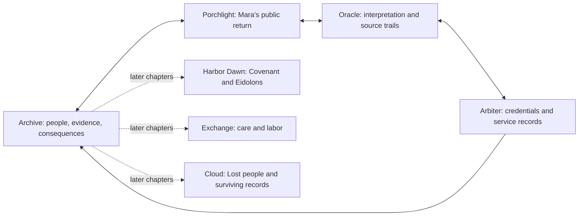
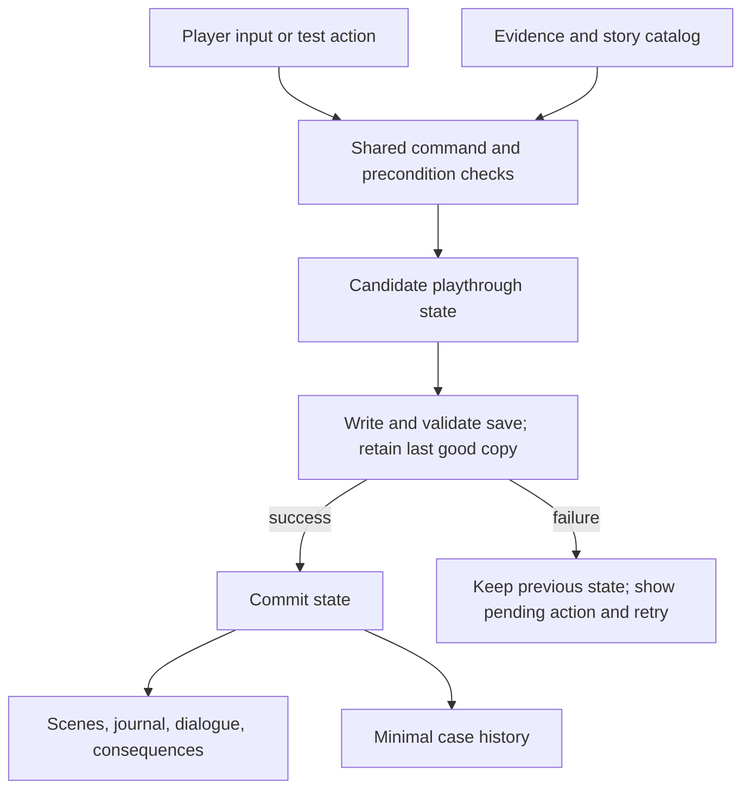

# The Network Mythos: Enter the Network - Plan

## Goal Capsule

Build a 3D narrative adventure in which the player enters the Network, encounters the forces that shape it, and decides what to do with truths that can help or harm real people.

**The player promise:** Follow a strange message into a world that manufactures reality. Learn how its inhabitants work. Find out what happened to the person behind the story. Decide what deserves to become public.

The recommended next release is a complete, compact adaptation of **Mara Vale — The Door Is Real**, designed for approximately 30–45 minutes on a first playthrough. This is a playtest target, not a demonstrated duration. It should prove a larger game can work: movement, atmosphere, encounters, investigation, media, and consequences in one connected experience.

**Planning baseline:** Desktop PC, first person, single player, stylized 3D, with Godot as the initial engine candidate. These are recommendations, not preferences already confirmed by the user. An optional platform question remains unanswered; desktop is the working assumption. The engine commitment follows an early playable proof. No game engine or hardware benchmark was run during this planning work.

**Target repository:** [breadback00-dev/the-network-mythos](https://github.com/breadback00-dev/the-network-mythos). All implementation paths are relative to this repository.

This plan supersedes the earlier room-focused next-version plan for future development. The existing browser game and 3D room demo remain reference builds. The implementation-ready scope is U1–U13 below; later chapters and expansion options require their own production plans.

## Product Contract

### Summary

The Archive becomes a place the player returns to between expeditions. Beyond it are connected Network spaces shaped by verification, attention, belonging, commerce, and memory. The Oracle interprets what happened; the Arbiter decides which identities and credentials count; other roles govern different parts of life inside the system.

Players advance by understanding these roles and using evidence in encounters. A voice message may contain a personal inconsistency. A short video may reveal how a public account was reconstructed. A meme may lead back to a manipulated source. An apparently authoritative avatar may make a claim its own records cannot support.

The world should feel mysterious, intimate, sometimes funny, and unsettling. Synthetic beings can care. Human institutions can deceive. The player must judge actions, provenance, and consequences rather than appearances.

### Problem Frame

The existing project has a strong thematic foundation and four authored mysteries. Its dossier format foregrounds reading and classification. The current 3D demo makes evidence spatial, but does not yet establish a substantial world to explore or let the wider mythos act on the player.

The user's feedback identifies three connected gaps: more narrative momentum, a stronger 3D experience, and a meaningful place for the roles and avatars. Adding more documents, decorative models, or extra rooms would leave those gaps unresolved.

The proposed change makes the mythos part of the action. **This is a deliberate new interpretation of the setting.** Existing design documents emphasize mythic language grounded in real systems and discourage a fantasy interface. This plan allows embodied encounters inside the Network while preserving the connection to human experience. It does not assume that every metaphor was already a literal creature in the canon.

The central risk is a beautiful world whose encounters still amount to reading a menu. The first release must test whether observing, questioning, presenting evidence, and choosing a response are satisfying activities in their own right.

### Requirements

The R identifiers below belong to this plan only; they do not inherit meanings from earlier plans.

| ID | Required player outcome | First-release acceptance |
|---|---|---|
| R1 | Understand who they are and why Mara matters. | Opening establishes the Archivist's work, Rafi's request, and Elian's concern through an event and a short exchange before extended exposition. |
| R2 | Explore a connected 3D world with clear navigation. | Four compact spaces support free movement, revisits, readable landmarks, and a reliable return to the Archive. |
| R3 | Experience mythos roles through distinct behaviour. | Oracle and Arbiter each have a complete evidence-driven encounter; a Warden demonstrates enforcement. Their functions are distinguishable without reading a glossary. |
| R4 | Investigate a fair mystery. | Three discoveries require relevant evidence and a defensible explanation. Viewing documents or collecting arbitrary quantities cannot solve them. |
| R5 | Understand what is observed, claimed, and reconstructed. | Evidence retains source ancestry and uncertainty. An avatar's assertion or a reconstructed scene cannot silently become independent confirmation. |
| R6 | Use contemporary media as playable evidence. | At least one voice message, one vertical short video, and one meme/repost chain each support a specific discovery or useful lead. Players can replay, inspect, and pin relevant moments. |
| R7 | Care about the people affected. | Rafi and Elian respond to progress; Mara is presented as a person with habits and intentions beyond her public account. |
| R8 | Make an informed consequential choice. | Publish, Bury, and Preserve each state what happens to evidence and have an authored benefit, cost, and visible aftermath. Private context is a separate explicit decision. |
| R9 | See the result persist. | The Archive, witness response, and case history reflect the committed ending after leaving and reopening the game. |
| R10 | Investigate comfortably through different input and sensory routes. | Remapping, controller support, readable interfaces, captions, equivalent evidence descriptions, adjustable camera comfort, and pause are available in the exported build. |
| R11 | Complete the chapter reliably offline. | Packaged content, recoverable saves, understandable media failures, and no dependency on social accounts or live AI services. |
| R12 | Recognize a larger world beyond this chapter. | An encounter journal and Archive map situate discovered people, roles, and places; subsequent cases have clear thematic destinations without an opening lore dump. |
| R13 | Experience a coherent art and sound direction. | Key spaces and major avatars have distinct silhouettes, motion, materials, sound, and interaction cues that remain readable at the agreed performance tier. |

### The player, story, and world

**Recommended player role: the Archivist.** The player recovers disputed histories and controls what leaves the Archive. Their immediate personal stake is responsibility for the people whose records they handle. A detailed missing-relative backstory or predetermined identity twist is not needed to start. If added later, it must strengthen the cases rather than make every stranger secretly part of the player's biography.

The opening should offer agency within roughly 90 seconds: Rafi has found a new video from Mara's apparently returned account; Elian sends a private warning that public confirmation could hurt her. The player can inspect the clip, ask a brief follow-up, and follow its provenance into the Network. These are proposed new scenes, not existing playable content.

First person is recommended for close encounters, object inspection, and the intimacy of hearing a voice in a space. Identity can still be expressed through the player's hands, reflection, journal, and later masks. A complete third-person character creator would add animation and camera work before the core adventure is proven. Perspective remains revisable at the first feel checkpoint.

The fiction has three clearly distinguished layers:

1. **The Archive and embodied traces:** places and objects the player directly visits or handles. Their interpretation can still be uncertain.
2. **The Network:** a traversable manifestation of its processes. An Oracle speaks for a summarization system; an Arbiter acts through verification rules. Their knowledge is bounded.
3. **Reconstructed material:** scenes assembled from records. Presentation identifies their source, missing information, and changes. Looking around such a scene does not create a new witness.

The Origin Realm signifies life beyond indexing. It must not become a convenient navigation marker that leads the player to Mara's private location.

### Roles and avatars: the full map

Existing names and meanings come from the hub registry, case designs, and project documents. All physical forms and gameplay treatments below are **new proposals**. A force can be expressed as a space, institution, group, or character; making every role a humanoid would flatten the setting.

| Role or concept | Existing meaning to preserve | Proposed expression and player action | Introduction |
|---|---|---|---|
| Oracle | Summaries and interpretation that smooth contradictions. | A composed figure surrounded by competing retellings. Present source evidence and make it distinguish what a source says from what its summary implies. | Full encounter in Mara. |
| Arbiter | Verification, trust, access; an account can pass without proving the person. | A precise adjudicator whose seals visibly authorize routes. Inspect the scope of a credential and request the underlying service record. | Full encounter in Mara. |
| Wardens | Enforcement of platform legitimacy and rules. | Repeating gatekeeper figures. Observe and satisfy a stated access rule; escalation is understandable and recoverable. | One bounded encounter in Mara. |
| Algorithm | Amplification of what performs. | Paths, billboards, and attention change around popular content. Compare prominence with evidential value. | Environmental presence in Mara; fuller later system. |
| Covenant | Belonging, ritual, care, and the obligations they create. | A welcoming communal space with members who remember your actions. Ask what membership gives and costs. | Porchlight traces; major Harbor Dawn role. |
| Silence | Suppression or steering presented as protection. | Missing replies and mediated access with an identifiable rationale. Recover the explanation and decide who benefits from withholding. | Later Harbor Dawn encounter. |
| Exchange | Pricing of care, labor, attention, and survival. | A transactional place with negotiable human consequences. Follow who provides care and who can afford access. | The Human Premium. |
| Devourer | Contagious outrage, panic, and reaction. | A crowd or changing mass fed by circulation. Interrupt, redirect, or expose a chain rather than reduce a health bar. | Campaign escalation; aftermath traces first. |
| Returned | People who leave the Network. | Human absence and traces of a life that does not owe the player documentation. Respect the limits of proof. | Mara's central question. |
| False Returned | Managed or synthetic proof of a person's return. | A persuasive public presence built from available records. Investigate its origin without treating unusual behaviour as automatic guilt. | Mara's public persona. |
| Eidolons | Synthetic personas with real social effects. | Relational characters whose care can matter despite disclosed origins. Judge consent and conduct. | Harbor Dawn. |
| Proxies | Human-operated personas and hidden labor. | Operators whose public identities and working conditions differ. Trace who is actually responding. | Harbor Dawn and The Human Premium. |
| Lost | People or histories made unavailable. | Absences, interrupted testimony, and remembered relationships. Reconstruct only what sources support. | The Lost Archive. |
| Cloud | Storage, retention, and machine memory. | A vast archive infrastructure with retention rules the player can investigate. | The Lost Archive. |
| Artifacts | Surviving fragments separated from context or consent. | Objects and media whose provenance can be followed and whose publication can be limited. | Core interaction throughout. |
| Origin / Origin Realm | Embodied life outside the Network. | A boundary and traces of ordinary life, not a searchable destination list. Final meaning comes from restraint as well as discovery. | Mara, then campaign conclusion. |

**Canon work still required:** project materials also mention Constructs and Echoes without a sufficiently settled taxonomy in the reviewed material. U1 must define them, merge them with an existing concept, or leave them explicitly unresolved. Do not quietly invent authoritative definitions. The player-facing journal reveals useful entries as encounters occur; the authoring bible keeps the complete registry from the outset.

### Moment-to-moment play

Explore a place → notice a discrepancy → inspect or replay its source → form a claim → test that claim with a person or avatar → gain a lead or change a relationship → decide what to share.

The evidence interface should feel like an investigator's workspace. Pin a video moment or an excerpt, compare it with another source, and choose or revise the explanation being put forward. It must explain why a proposed link is weak without announcing the entire solution. An optional hint ladder moves from a question, to a source pointer, to an explicit explanation. There is no punishment for asking for a hint.

Use small spaces with multiple approaches and revisitable discoveries. Avoid a single corridor of mandatory speeches. The first chapter may gate access through the Oracle and Arbiter, but already discovered evidence remains usable regardless of visit order. No permanent lockout follows a mistaken accusation.

### First chapter: Mara — The Door Is Real

| Beat | Player experience | Human or investigative payoff |
|---|---|---|
| 1. The message | In the Archive, receive Rafi's public concern and Elian's private warning. Inspect the new short video. | Understand the conflict between correcting a public story and protecting Mara. |
| 2. Porchlight | Enter a reconstruction of Mara's public community. Compare an older voice recording, the new performance, and a circulating meme. | Her ordinary habits become memorable; the public return begins to feel curated. |
| 3. The Oracle | Ask what was verified. Challenge the leap between an authoritative summary and the underlying verification scope. | Discovery D1: a claim about account authenticity does not establish the person returned. |
| 4. The Arbiter | Use the source trail to reach a service record. A Warden enforces a visible authorization rule. Request and compare the commissioning material. | Discovery D2: establish the provenance of the reconstructed public return. |
| 5. The private trace | Return to Elian's message and a redacted physical fragment associated with an ordinary life outside the Network. | Discovery D3: distinguish a private lead from publishable proof, and explain why circulating it could invite unwanted attention. |
| 6. The packet | Review the evidence and uncertainties. Choose Publish, Bury, or Preserve, and whether to include private context. | Commit a position with a clear benefit and cost. |
| 7. The return | Hear a witness response; see the Archive and public account of the case change. | A complete ending that also raises the next case's question. |

Rafi and Elian carry the first chapter through authored voice exchanges and responses. Mara's old and returned media establish her presence. Sera Nox, Jo Bell, and interview hosts enter where their evidence matters; they do not all require full-body performances in this release.

**Evidence adaptation rules:**

- The old audio's kettle interruption is a character detail and a lead. The returned voice's lack of interruptions is not proof that someone is synthetic.
- Existing artifact 04 is dated before artifact 09. Do not claim it cites that later report; it can overstate the verification service's scope without inventing a chronology contradiction.
- Existing invoice 13 strongly suggests the reconstruction through Porchlight context but does not directly name Mara. For a conclusive D2, author a shared project or asset identifier between the verification service record and the commission. Record this as a new adaptation detail in the canon ledger. Until then, the deduction must remain an inference.
- Existing private fragment 14 is redacted and does not establish a precise current location. Its disclosure can create an unwanted association or a hunt for an alias. Do not portray it as coordinates to Mara's house.
- D1, D2, and D3 need explicit evidence predicates and alternate accepted wording. No rule may count a summary and its repost as two independent witnesses.

### Media that belongs in this world

| Format | Proposed first use | What the player can do |
|---|---|---|
| Voice message | Elian's intimate warning; an older Mara recording with a room interruption. | Pause, replay a cue, read speaker-labelled captions, compare wording, pin the relevant moment. |
| Vertical short video | Mara's polished return clip in a fictional social feed. | Scrub or replay a cue, inspect the caption and source envelope, compare with the older performance. |
| Meme and reposts | A joke compresses the disappearance into a reassuring public story. | Follow its source chain, inspect what was cropped, compare popularity with the original statement. |
| Physical fragment | An ordinary handwritten or printed trace of life outside the feed. | Examine, read an equivalent description, and choose how much context enters the final packet. |

Use original fictional posts and platform styling appropriate to the world. A TikTok-style format does not require a TikTok account, embedded website, or live feed. Humor should reveal a community's coping or manipulation, not break tone with disposable topical references.

First-release content budget: one 20–40 second vertical clip; two short evidence recordings; a small set of Rafi/Elian exchanges; one meme with an original and two contextual variants; approximately 10–12 distinct evidence objects selected from the existing case. These are production targets, not a new rigid collectible quota. Dialogue length follows testing. Every essential media clue has an equally informative text or image-description route.

### Choices and consequences

The ending is authored along two axes: disposition of the public evidence and handling of the private trace. The packet preview states the destination and contents before commitment. It never actually posts to the internet.

| Disposition | Benefit | Cost | Visible result |
|---|---|---|---|
| Publish | Challenge the misleading return with an accountable public record. | The controversy attracts attention, including attention the witnesses did not request. | A public summary changes; Rafi responds to what was supported and what was exposed. |
| Bury | Prevent this packet from circulating and reduce immediate pressure on witnesses. | The public misrepresentation remains largely unchallenged. | The Archive seals the active case; a witness acknowledges relief or disappointment. |
| Preserve | Keep a sourced record for later accountability without immediate release. | Correction is delayed, and retained evidence remains a responsibility. | A restricted collection appears; a witness asks who will control future access. |

For this chapter, Bury seals the packet and closes the active investigation; it does not claim to erase every copy in existence. Preserve keeps it available for an explicitly described future review. Including private context means circulation under the chosen disposition: public in Publish, restricted in Preserve, sealed in Bury. Withholding leaves the packet without that fragment or identifying contextual details. Six outcome combinations receive authored, proportionate responses; the private toggle must not imply the same exposure in all three dispositions.

The game retains minimal decision metadata for its history. In-fiction private material may be excluded from the resulting packet without promising secure destruction of the game's shipped fictional assets. No morality score declares one route correct. Each route must preserve both a benefit and a cost.

### Campaign direction beyond the first release

| Chapter | New playable question | Mythos expansion | Carryover to define before production |
|---|---|---|---|
| The Half Synthetic Community | If care helped people, what changes when its origin was concealed? | Covenant, Eidolons, Proxies, Silence. | How communities respond to the Archivist's disclosure practices. |
| The Human Premium | Who gets embodied care, and who performs the invisible work? | Exchange and the operators behind apparent automation. | What access and accountability cost; avoid a simple currency-grind solution. |
| The Lost Archive | Can a person remain erased while fragments of them keep working? | Cloud, Lost, memory and retention. | What previous preservation and deletion choices actually retained. |
| Campaign conclusion | Who gets to define a person, and who gets to leave? | Return to Origin and the accumulated human consequences. | Resolve the Archivist's responsibility without a single omniscient truth reveal. |

These are episode directions, not a commitment to four identical chapter templates. Large connected districts, identity masks, more systemic negotiation, embodied companions, third-person play, VR, consoles, and community-authored cases remain possible expansion paths. They enter production when they improve a proven activity and have an affordable content and testing model. A large open world, combat system, or multiplayer service is not a prerequisite for the current promise.

## Planning Contract (KTD)

### Research and design reasoning

Frictional describes SOMA's encounters and puzzles as parts of the story, with themes emerging through player action. The useful lesson here is to make the Oracle's behaviour enact interpretation and the Arbiter's behaviour enact verification. This does not require adopting SOMA's combat avoidance or difficulty philosophy wholesale. [SOMA design pillars](https://frictionalgames.com/2013-12-the-five-foundational-design-pillars-of-soma/)

Mobius presents Outer Wilds as exploration of a changing world through mysteries and investigative tools. The proposed application is to make a discovered explanation change where the player chooses to go. This plan does not copy its time loop or assume its open-world scale. [Outer Wilds](https://www.mobiusdigitalgames.com/outer-wilds.html)

These precedents support design hypotheses. They do not prove that this particular game's encounters will be enjoyable. The native first chapter and new-player sessions are the evidence that matters.

### KTD1 — Dedicated engine, with an early commitment gate

**Decision:** Start the engine proof in Godot using GDScript. Reverify and pin the stable engine and matching export templates at implementation start. The official Windows page listed Godot 4.7.2 during this research. Do not install a different development build simply because its documentation has a desired feature. [Godot Windows download](https://godotengine.org/download/windows/)

| Candidate | Why it fits | Main tradeoff | Decision trigger |
|---|---|---|---|
| Godot | Direct control over a compact single-player adventure, scene-based 3D, a small local build workflow. | Media format constraints and a smaller ecosystem for some production workflows need an early proof. | Recommended first candidate; pass the camera, avatar, media, and export checks in U2. |
| Unity | Integrated video tools, Timeline, and Cinemachine offer useful production options. | More tooling and package decisions; switching after content production would be costly. | Compare with the same fixture if Godot fails a required workflow after one bounded repair cycle. |
| Unreal | Strong cinematic tooling through Sequencer and its movie pipeline. | Heavier authoring workflow and hardware demands for the proposed project. | Reassess if the artistic brief becomes substantially more cinematic or photorealistic and the team can support it. |

Unity's official documentation covers its [Video Player](https://docs.unity3d.com/6000.0/Documentation/Manual/Video.html), [Cinemachine](https://docs.unity3d.com/Packages/com.unity.cinemachine@3.1/manual/index.html), and [Timeline](https://docs.unity3d.com/Packages/com.unity.timeline@1.8/manual/index.html). Epic documents [Sequencer and cinematic production](https://dev.epicgames.com/documentation/en-us/unreal-engine/cinematics-and-movie-making-in-unreal-engine) and recommends 32 GB RAM and 8 GB graphics RAM for its editor; those are editor recommendations, not this game's minimum specification. [Unreal hardware guidance](https://dev.epicgames.com/documentation/unreal-engine/hardware-and-software-specifications-for-unreal-engine?lang=en-US)

The comparison is a project recommendation, not a benchmark result. We have not confirmed the user's GPU, editor installations, or production budget. If U2 selects another engine, update the engine-specific paths, APIs, export procedure, and tests in this plan before starting the dependent units; retain the Product Contract and source content. Godot's MIT licensing supports commercial use with the applicable notices retained. Any paid assets, software, performers, or porting services are separate production decisions. [Godot license](https://godotengine.org/license/)

### KTD2 — Desktop first; portability as a deliberate later project

**Decision:** Target a Windows desktop export for the first chapter. Select a named reference machine in U2 and record its hardware and quality settings. Test Forward+ first, with a deliberately authored lower quality tier if required.

Godot's renderer documentation distinguishes Forward+, Mobile, and Compatibility; renderer changes can require material and lighting adjustments. Browser export uses Compatibility/WebGL 2, and current Godot 4 C# projects do not support web export. GDScript keeps a browser edition technically more plausible, but does not establish performance or visual parity. [Renderers](https://docs.godotengine.org/en/stable/tutorials/rendering/renderers.html), [Web export](https://docs.godotengine.org/en/stable/tutorials/export/exporting_for_web.html)

If the user selects browser first, revisit this decision before U3–U13 and test the representative scene in that environment. Console releases need separate platform and porting work; they are not an automatic export promise. [Godot console support](https://godotengine.org/consoles/)

### KTD3 — Author the world around roles and readable behaviour

**Decision:** Use compact connected spaces with a modular environment kit. Oracle and Arbiter receive finished encounter design before the wider cast receives production models. Give each role a five-part brief: motivation, source of authority, limits, visible behaviour, and what the player can change.

Art direction: warm, worn, physically plausible Archive; seductive, edited Porchlight; layered and conflicting Oracle surfaces; sharp institutional Arbiter geometry. Humans retain ordinary details and imperfections. Synthetic status is never encoded as a universal villain color or glitch effect. Build a representative scene with a model, light, motion, voice, and interface together before commissioning a full cast.

Use Blender source assets with reviewed glTF/GLB exports in the game. Godot recommends glTF 2.0 and documents Blender conversion; explicit exported assets make the runtime project less dependent on every contributor's Blender installation. [3D import formats](https://docs.godotengine.org/en/stable/tutorials/assets_pipeline/importing_3d_scenes/available_formats.html)

### KTD4 — Separate evidence, belief, and story state

**Decision:** Maintain one immutable content catalog and one mutable per-playthrough state. Evidence identifiers survive adaptation from the browser case. Each item records source ancestry, event/capture dates, medium, content revision, claims it supports or challenges, and accessibility equivalents.

Player state stores acquired evidence, inspected cues, proposed claims, resolved discoveries, dialogue progress, visited spaces, decisions, and checkpoint. Encounter presentation reads that state; it cannot independently invent a second truth model. Reconstruction identifiers link to their inputs. Reposts and summaries share ancestry with their source.

The rule evaluator accepts explicit actions against current preconditions. It produces state changes and a reason for accepted or rejected evidence links. Read counts and animation completion are not truth predicates. Cue selection may be performed through video, transcript, or accessible description with equivalent results.

### KTD5 — Authored narrative first

**Decision:** Use a small data-driven dialogue and encounter graph with conditions, choices, and effects. Keep prose outside scene code. Avoid a general-purpose narrative framework beyond what the first chapter requires.

Inkle's ink demonstrates the value of writing, testing, and exporting branching narrative in a dedicated authoring workflow. Its official site documents Unity integration and an Unreal integration; it is not evidence that a particular Godot integration is production-ready. Start with the simple graph here. If authoring becomes the bottleneck, evaluate an actual compatible integration against the same story and save tests before adopting it. [ink and Inky](https://www.inklestudios.com/ink/)

Runtime avatars use authored responses and bounded state. They need personality, timing, gesture, and acknowledgement of evidence; live generated dialogue is not needed to accomplish those things. Future AI conversation experiments must not create canonical clues, invent witness testimony, or silently change outcomes.

### KTD6 — Packaged media with equal investigative access

**Decision:** Deliver media locally with a shared cue system, transcript, speaker data, captions, and image descriptions. Preserve editable masters separately from runtime exports. Include a rights and attribution manifest for all final assets; temporary voice and art are visibly marked in development records.

Godot's built-in video path supports Ogg Theora rather than treating the demo's MP4/WebM assets as drop-in files. Its documentation describes CPU decoding and using a SubViewport for video on a 3D surface. Test one representative clip before producing the rest. [Playing videos](https://docs.godotengine.org/en/stable/tutorials/animation/playing_videos.html)

The player API exposes playback position and length, but actual seeking, audio synchronization, subtitle timing, pause/resume, looping, and replay need verification in the pinned desktop export. [VideoStreamPlayer](https://docs.godotengine.org/en/stable/classes/class_videostreamplayer.html)

The inspector offers replay-from-cue even if fine scrubbing needs further work. U2 must establish the accepted replay behaviour before media production; a failed player cannot strand the essential clue. Focus loss pauses media; leaving the scene stops it; only the active inspector owns evidence audio.

### KTD7 — Saves are part of the story contract

**Decision:** Use a separate native save directory and versioned schema. Do not import or overwrite the browser game's network.archive.state or case-specific localStorage. Preserve existing source content and demo behaviour.

For a final decision, validate the proposed packet, create a candidate state, write and validate a replacement save while retaining the last good copy, then expose the committed outcome. A write or replacement failure leaves the choice pending and offers retry; it must not show a successful irreversible ending that was never persisted. Verify the actual filesystem behaviour on the target platform rather than assuming all replacement operations are atomic.

Use a playthrough identifier, content/schema versions, and commit identifier so repeat input cannot duplicate an ending. Keep a minimal outcome record separate from the evidence packet. Recover from a backup transparently with an explanation. An unsupported newer save is preserved and reported, never silently reset. Autosave discoveries and safe scene checkpoints; do not require reconstructing every camera frame or partly played sound on load.

### KTD8 — Accessibility affects clue design from the beginning

**Decision:** Provide captions and comfort settings before the opening media. Important non-speech audio gets a meaningful caption; clue-bearing images and motion receive equivalent descriptions. Player knowledge cannot depend on hearing the kettle, noticing a color, or timing a precise button press.

Use remappable keyboard/mouse and controller actions with matching prompts. Offer sensitivity, invert look, adjustable field of view, disabled head bob and camera shake by default, reduced motion, text sizing, separate volume controls, and pause during inspection and dialogue. Hint use is recorded only for optional local playtest analysis, never scored as failure.

These choices are informed by Microsoft's guidance on [captions and subtitles](https://learn.microsoft.com/en-us/gaming/accessibility/xbox-accessibility-guidelines/104), [motion and visual distractions](https://learn.microsoft.com/en-us/gaming/accessibility/xbox-accessibility-guidelines/117), [input](https://learn.microsoft.com/en-us/xbox/accessibility/xbox-accessibility-guidelines/107), and [audio description](https://learn.microsoft.com/en-us/xbox/accessibility/xbox-accessibility-guidelines/111). They are implementation requirements to test, not a claim of accessibility certification.

### KTD9 — Keep the prototype useful and avoid a premature rewrite of everything

**Decision:** Create a new game/ project alongside the current web game. Adapt the case content with an explicit source map. Reuse lessons from the 3D demo's interaction and discovery work; do not assume its JavaScript runtime, storage, media, or UI can be transferred unchanged to a native engine.

Proposed source boundaries:

| Area | Responsibility |
|---|---|
| game/content/ | Case, evidence, dialogue, role, and consequence data with stable identifiers. |
| game/scripts/domain/ | Discovery rules, story actions, packet policy, state validation. |
| game/scripts/services/ | Save persistence and media ownership. |
| game/scenes/ | Player, spaces, avatars, and inspectable objects. |
| game/ui/ | Evidence inspector, journal, settings, choice preview, recovery messages. |
| game/tests/ | Domain, save, content, and scene-integration checks. |
| tools/content/ | Small adaptation and validation tools, only where repetition warrants them. |
| art-source/ | Editable visual and audio masters outside runtime import scope. |
| docs/network-3d/ | Canon ledger, encounter briefs, production register, and verification evidence. |

All paths in the implementation units are proposed paths relative to the target repository; none of this native structure is claimed to exist already.

### KTD10 — Build a testable game without a second gameplay path

**Decision:** UI, controller input, and developer test actions call the same game commands. A small local scenario runner can load fixture states, submit an evidence claim, advance a dialogue choice, and inspect resulting state. It is a development tool, not a network service or a separate rules engine.

Godot supports command-line scripting, headless operation, and export workflows. Use these for content, state, and packaging automation after the executable and templates are pinned. They do not substitute for running the rendered exported game with real audio and input. [Command-line workflow](https://docs.godotengine.org/en/stable/tutorials/editor/command_line_tutorial.html)

## Implementation Units

### Sequence and release checkpoints

| Unit | Deliverable | Dependencies | Checkpoint |
|---|---|---|---|
| U1 | Canon, chapter, and role briefs | None | A: direction ready to build |
| U2 | Native engine and media proof | U1 | B: engine and feel decision |
| U3 | Movement, interaction, comfort | U2 | C: foundation |
| U4 | Evidence and discovery rules | U1, U2 | C |
| U5 | Versioned saves and recovery | U2, U4 | C |
| U6 | Narrative and witness responses | U4, U5 | C |
| U7 | Media and evidence inspector | U3, U4, U5 | C |
| U8 | Connected Archive and Porchlight | U3, U6, U7 | D: playable chapter skeleton |
| U9 | Oracle encounter | U6, U7, U8 | D |
| U10 | Arbiter and Warden encounter | U5, U6, U9 | D |
| U11 | Packet and six ending variants | U5, U6, U10 | D |
| U12 | Finished visual and audio pass | U2; D playtest passed | E: representative release candidate |
| U13 | Integrated verification and packaging | U11, U12 | F: first-release decision |

Units can overlap when dependencies permit, but each new capability must leave the chapter playable. A checkpoint failure triggers a focused correction in the affected unit; it does not silently reduce a requirement.

### U1 — Lock the first chapter's meaning

**Goal:** Convert the direction into an internally consistent authoring brief. Covers R1, R3–R8, R12.

**Files:** Create docs/network-3d/experience-bible.md, canon-ledger.md, mara-beats.md, roles.md, content-register.md, and playtest-protocol.md. Reference existing GAME_DESIGN.md, Archive Hub/script.js, all case-design.md files, and Mara's profile and source artifacts.

**Approach:** Map all reviewed roles; separate inherited facts from adaptation changes. Define the three discoveries, accepted claims, all six outcomes, encounter motivations, and each media asset's job. Resolve Constructs/Echoes only if needed for this release. Add the explicit D2 identifier connection and audit dates. Script the opening and ending before expanding ambient dialogue. Prepare the V7 playtest protocol now so checkpoint D can run before final art production.

**Verification:** A content table traces every conclusion to sources and identifies missing evidence. Walk through each ending and each avatar's knowledge limits. Check that the private trace cannot locate Mara and that the player does not need to accept an unsupported theory to progress. This is an editorial review, not an artificial unit test for prose.

### U2 — Prove the engine with the hardest representative moment

**Goal:** Establish camera comfort, avatar presence, media interaction, and an actual desktop export before bulk production. Covers R2, R3, R6, R10, R11, R13.

**Files:** Create game/project.godot, export_presets.cfg, scenes/proof/encounter_proof.tscn, tests/fixtures/media/, and docs/network-3d/engine-proof.md. Pin tool versions in the project documentation.

**Approach:** One small room, one animated avatar, one short video on a surface, voice plus captions, a transcript cue, one evidence interaction, and exit/relaunch. Use representative lighting and provisional original or licensed assets. Record hardware, engine, renderer, timings, output size, and production friction. Evaluate a brief first-person interaction against the user's desired feel.

**Verification:** In the exported game, verify input, stable camera, legible avatar, video decode, cue replay/seek, caption sync, focus loss, and media failure fallback. A manual checklist and captured evidence are required. Run one targeted repair cycle if needed. If a required behaviour still fails, compare Unity with the same fixture before authoring the rest of game/. No engine-switch permission is needed merely to research a reversible prototype; any paid purchase remains a separate decision.

### U3 — Make movement and inspection comfortable

**Goal:** A dependable first-person player and consistent interaction language. Covers R2, R10.

**Files:** Create game/scenes/player/player.tscn, game/scripts/player/, game/ui/settings/, game/scripts/domain/input_actions.gd, and game/tests/integration/test_player_interaction.gd.

**Approach:** Free movement, look, interact, pause, journal, and inspect; contextual prompts; stable collision; clear exit from every overlay. Settings exist before the opening. Input ownership passes explicitly between movement, media, dialogue, and menus. A recovery action returns a stuck player to a safe checkpoint without discarding discoveries.

**Verification:** Test remapped actions and controller prompts, reopening overlays, focus changes, failed interactions, scene transitions while inspecting, and return from pause. Manually test comfort and text size in the export. Headless tests cannot certify camera feel.

### U4 — Implement fair evidence and discoveries

**Goal:** Make conclusions depend on what sources support. Covers R4, R5.

**Files:** Create game/content/cases/mara/, game/content/roles.json, game/scripts/domain/evidence_catalog.gd, discovery_rules.gd, playthrough_state.gd, and game/tests/domain/test_discoveries.gd. Add tools/content/validate_content.py only if useful for the chosen data format.

**Approach:** Preserve source IDs in a mapping to native objects. Model source ancestry, timestamps, uncertainty, cue IDs, prerequisites, and accepted links. Keep the three discoveries explicit. Validate that every referenced source and accessible equivalent exists.

**Verification:** Correct evidence works in any acquisition order; irrelevant evidence and read counts fail; a repost plus original does not become two sources; voice irregularity alone does not prove reconstruction; D2 requires the authored provenance link; descriptions and media cues produce equivalent claims. Missing or inconsistent content stops the build with a precise authoring error.

### U5 — Persist progress without inventing a successful save

**Goal:** Reliable continuation and truthful decision commitment. Covers R9, R11.

**Files:** Create game/scripts/services/save_service.gd, game/scripts/domain/save_schema.gd, game/ui/save_recovery/, game/tests/domain/test_save_schema.gd, and game/tests/integration/test_save_recovery.gd.

**Approach:** Implement KTD7 with a last-good backup and validation at each write stage. Give ordinary progress and final decisions consistent failure feedback. Keep per-playthrough saves isolated and settings separate. Support known schema migrations explicitly; preserve unknown newer versions.

**Verification:** Inject failure before write, during write, before replacement, and after replacement but before presentation. Cover truncation, invalid references, repeated decision input, absent backup, supported migration, and unsupported future version. Relaunch must recover either the old or new valid commit with matching history, never a mixture. Verify on a real desktop filesystem as well as mocked boundaries.

### U6 — Give the story responsive people

**Goal:** Authored conversations react to evidence and progress. Covers R1, R3, R7.

**Files:** Create game/content/dialogue/, game/scripts/domain/story_graph.gd, game/scenes/dialogue/, game/ui/dialogue/, and game/tests/domain/test_story_graph.gd.

**Approach:** Add Rafi and Elian's opening, mid-case, and aftermath exchanges. Conditions read central state; effects go through shared commands. Allow repeat inspection and recoverable questioning. The hint ladder suggests without requiring a particular dialogue order.

**Verification:** Opening remains intelligible if optional lines are skipped; re-entering dialogue cannot duplicate rewards; a player cannot hear an outcome from a future state; all choices terminate or return to a valid node; loading restores a safe conversation boundary; captions and speaker labels match the current line.

### U7 — Turn media into usable evidence

**Goal:** Inspectable clips, voice, and memes with accessible cue selection. Covers R4–R6, R10, R11.

**Files:** Create game/scripts/services/media_service.gd, game/ui/evidence_inspector/, game/content/media/, game/tests/integration/test_media_lifecycle.gd, and game/tests/domain/test_media_cues.gd.

**Approach:** Build the common inspector and world-screen adapter. Include timeline or cue replay as established by U2, source details, transcripts, image descriptions, and pinning. Reposts expose lineage. A failed asset presents its equivalent and a recoverable error without pretending playback succeeded.

**Verification:** Replay a late cue, pause and resume, switch items rapidly, leave the room during playback, reopen the same item, mute audio, and use only descriptions. Captions remain synchronized within the agreed tolerance in Verification V4. No duplicate audio survives scene changes. Missing video still permits the same essential discovery through the equivalent route.

### U8 — Connect the Archive and Porchlight

**Goal:** Establish a world the player can navigate and care about. Covers R1, R2, R6, R7, R12.

**Files:** Create game/scenes/world/archive/, porchlight/, game/scripts/world/scene_router.gd, game/ui/journal/, and game/tests/integration/test_world_routes.gd.

**Approach:** Build simple geometry first, with distinct landmarks, short transitions, physical evidence placement, and contextual human contact. The journal separates people, encountered roles, evidence, and leads; the world map reveals reachable places. Implement the original/returned media comparison and meme trail.

**Verification:** A new player finds the first lead without a lore lecture. Revisit after gaining evidence; load at either space; travel with a media panel open; recover from a missing destination scene. No discovery is lost and no return route depends on an already consumed interaction.

### U9 — Make the Oracle an encounter

**Goal:** The player experiences the difference between a convincing account and a supported one. Covers R3–R5.

**Files:** Create game/scenes/world/oracle/, game/scenes/avatars/oracle/, game/content/encounters/oracle.json, and game/tests/integration/test_oracle_encounter.gd.

**Approach:** Build the Oracle chamber as the third connected space, with routes back to Porchlight and onward to the Arbiter. The Oracle presents a coherent interpretation through speech and changing surfaces. The player asks for support, selects a source excerpt, and challenges the overclaim. Correct reasoning makes the limit visible and exposes the service trail. Wrong evidence receives a specific, recoverable response. Animation does not determine whether the deduction is valid.

**Verification:** Complete D1 with both media and text routes; try the summary as its own corroboration; leave midway and return; reload after resolution; skip the animation. The Oracle never reveals private information it cannot access, and repeating the encounter does not duplicate progress.

### U10 — Make authority and enforcement playable

**Goal:** Differentiate Arbiter from Oracle and Wardens. Covers R2–R5.

**Files:** Create game/scenes/world/arbiter_vault/, game/scenes/avatars/arbiter/, warden/, game/content/encounters/arbiter.json, and game/tests/integration/test_arbiter_encounter.gd.

**Approach:** Provide one bounded access rule: a provenance request opened through D1 authorizes inspection of a service record, not access to a person's private life. The Warden checks that rule consistently. The Arbiter explains exactly what the credential establishes. The player links the authored commission identifier to reach D2. No combat or precise stealth is required.

**Verification:** Premature entry gives an understandable route forward; the valid request works after reload; repeated challenges cannot lock the gate permanently; unrelated credentials fail; the D2 link cannot be solved by visual resemblance or the invoice's existence alone.

### U11 — Make the final choice concrete

**Goal:** Complete D3 and end with a persistent human consequence. Covers R4, R7–R9.

**Files:** Create game/ui/packet_preview/, game/content/endings/mara.json, game/scripts/domain/packet_policy.gd, consequence_rules.gd, and game/tests/integration/test_mara_endings.gd.

**Approach:** Separate supported findings, uncertainties, and private context in the preview. Require the three discoveries, with optional hints available. Present all three dispositions and the private-context toggle, then commit through the save service. Update Archive objects, a witness response, and case history from the same committed record.

**Verification:** Play all six combinations; withhold the private trace and inspect the resulting packet; compare sealed and restricted access language; cancel the preview; double-submit; simulate save failure; close immediately after a successful commit. No branch leaks withheld context or shows a different ending after relaunch.

**Checkpoint D:** With the complete chapter playable in provisional art, run the V7 understanding and engagement checks using the protocol prepared in U1. Record results before U12. Fix failed encounter or story checks here and in the relevant earlier unit. U13 repeats the checks with fresh players on the finished export; the earlier sessions are not reused as independent confirmation.

### U12 — Produce a coherent finished presentation

**Goal:** Replace provisional assets where they carry the experience. Covers R3, R6, R7, R13.

**Files:** Create or update art-source/, game/assets/, game/scenes/avatars/, game/scenes/world/, and docs/network-3d/asset-register.md and art-audio-review.md.

**Approach:** After the complete simple chapter passes checkpoint D, finish Oracle, Arbiter, the Warden, the key spaces, the vertical clip, and witness recordings. Prioritize silhouette, gestures, spatial sound, and timing over object count. Record asset origin, allowed use, edits, and attribution. Keep editable masters, caption revisions, and runtime media synchronized.

**Verification:** Review the full experience with sound and muted, at default and large text, and at every quality tier established in U2. Compare captions against final audio, identify all provisional assets, confirm import scale/collision/animation, and profile the busiest representative scene. A visual pass must not move or hide essential clues without rechecking the affected discovery.

### U13 — Test the exported chapter and make the release decision

**Goal:** A complete local deliverable with evidence that the direction works. Covers R1–R13.

**Files:** Create game/tests/scenarios/mara_complete.json, game/tests/run_scenarios.gd, docs/network-3d/verification-report.md, known-issues.md, and release-manifest.md. Update docs/network-3d/playtest-protocol.md and repository run instructions when the native build exists.

**Approach:** Run domain and scenario checks, then play the packaged Windows build with keyboard/mouse and controller. Run fresh-player sessions against V7; capture observations with consent in local notes. Review confusing evidence and encounters before increasing campaign scope. Package the executable and required data with launch instructions and notices.

**Verification:** Meet the Verification Contract and Definition of Done. Record failures honestly, fix blockers, and repeat only affected checks plus a full completion run after material integration changes. The output is a local reviewable release candidate; uploading, store submission, or public release is a later action.

## Verification Contract

No native game tests or player studies have run yet. The following are planned checks with explicit evidence requirements.

| ID | Check | Evidence and passing condition |
|---|---|---|
| V1 | Canon and clue integrity | Reviewed source-to-claim matrix. All three discoveries supported; proposed new details identified; no date contradiction, circular corroboration, or false claim that fragment 14 locates Mara. |
| V2 | Rules and narrative | Automated domain/scenario tests cover valid, invalid, repeated, and reordered actions. All six endings are reachable from legitimate play and impossible from merely marking everything read. |
| V3 | Save and recovery | Fault-injection results plus real filesystem relaunch tests. Old/new committed states stay internally consistent; no false success or silent destruction of an unsupported save. |
| V4 | Media and accessibility | Exported build demonstrates video, voice, meme, cue replay, captions, descriptions, remapping, controller, comfort settings, and large text. Test cues at start/middle/end and after replay; caption timing target within 150 ms of authored cue boundaries, with perceptual review of speech and significant sounds. |
| V5 | Navigation and interaction | Full exported playthrough; every overlay can be exited, every space has a return or recovery route, and scene changes do not leave stale input or audio. |
| V6 | Performance and packaging | Named reference hardware, engine, renderer, resolution, quality setting, and frame-time capture. Initial target: 1080p, 60 fps with at least 95% of measured gameplay frames at or below 20 ms on the chosen reference machine. Profile traversal, avatar encounter, and video playback separately. Record loading separately; investigate repeated gameplay stalls above 100 ms. These are proposed targets, not measured capabilities. |
| V7 | New-player understanding and engagement | At least five fresh players. Aim for four to explain their role within three minutes, find a useful lead within eight minutes, distinguish Oracle from Arbiter after both encounters, and distinguish supported findings from uncertainty at the ending. At least four should want to continue and identify a specific memorable moment. Record hint use and reasons for confusion; do not treat this tiny sample as market validation. |
| V8 | Release integrity | A clean extracted package starts offline, completes, saves, and resumes without editor tooling. Rights/attribution records and known issues included; current browser game and demo still available. |

If V7 fails, identify whether the issue is story clarity, interaction, navigation, or encounter depth. Revise that element and test with new players before producing another full chapter. If exploration feels like walking between menus, add an observable avatar response or a meaningful spatial decision to the existing encounter before adding more map area.

At checkpoint B, record whether third-person presentation would solve an observed problem that first person cannot. Do not change perspective merely to increase apparent production value. At checkpoint D, assess the complete chapter with provisional art before authorizing the full presentation workload in U12.

## Definition of Done

- [ ] U1–U13 are complete or a documented scope change has explicitly revised this contract.
- [ ] One complete Mara chapter provides four connected spaces, two major avatar encounters, one Warden interaction, three fair discoveries, and a persistent ending.
- [ ] Voice, short video, meme, and physical evidence each have an investigative purpose and accessible equivalent.
- [ ] The six disposition/private-context outcomes are authored, distinct where appropriate, and verified after relaunch.
- [ ] All required checks V1–V8 have recorded results. Blocking defects are fixed; remaining limitations are visible in known issues.
- [ ] New-player feedback supports the direction or records the specific redesign needed before campaign expansion.
- [ ] A local packaged build, launch instructions, verification report, asset register, and source changes are reviewable.
- [ ] The previous browser game, saves, authored cases, and room demo remain intact.

This definition completes the first release, not the entire campaign and not a public launch.

## Appendix

### What carries forward and what changes

| Carry forward | Change under this plan |
|---|---|
| Human stakes, source provenance, uncertainty, and consequences. | The dossier becomes one tool within a traversable world. |
| Mara and the other authored cases as narrative foundations. | New encounters and adaptation details are permitted and documented. |
| Archive identity and Publish/Bury/Preserve. | Archive becomes a home space; choices have concrete destinations and aftermath. |
| Media evidence and discovery lessons from the demo. | Native playback, input, persistence, and scene integration are implemented for the selected engine. |
| Mythic roles grounded in social and technical structures. | Roles can be embodied and encountered rather than only revealed as cards. |
| The existing prototype as an accessible reference. | Room-only exploration, browser-only delivery, fixed 15-document layouts, and a two-case ceiling are not constraints on the new vision. |

### Production and resourcing

Plan in checkpoints rather than promise a completion date before the engine and content workflow are measured. The work needs gameplay engineering, narrative design, environment/character art and animation, sound/voice production, and testing. One person can cover several roles, but those jobs do not disappear when code generation is fast.

At checkpoint B, estimate the full chapter from observed work: cost per finished encounter, per connected space, per minute of final voice/video, and per tested outcome. Include time for revision, asset integration, and packaging. At checkpoint D, re-estimate the remaining presentation work from the completed simple chapter. Maintain optimistic, expected, and pessimistic ranges; explain which assumptions produce each range.

The largest likely production drivers are avatar animation, final voice/video, environmental finish, and branch verification. Use placeholders to learn early, then finish the assets that carry the story. No specific budget, staffing level, deadline, or permission to purchase assets has been assumed.

### Decision register and research boundaries

| Question | Current recommendation or uncertainty | Resolve by |
|---|---|---|
| Initial platform | Desktop PC assumed; optional user question pending. | Before committing the production project after U2. |
| Camera | First person recommended; player avatar expression can develop later. | U2 interaction and comfort review. |
| Engine | Godot candidate; no local proof yet. | U2 native export and media checks. |
| Hardware and performance tier | Local hardware could not be verified during planning. | U2 reference machine record. |
| Literal mythos and evidence rules | New encounters are a proposed adaptation; provenance remains authoritative. | U1 canon ledger and V1. |
| Constructs and Echoes | Definitions not settled in reviewed material. | U1 if required; otherwise retained as authoring questions. |
| Timeline and budget | Unknown; no responsible fixed quote yet. | Measured workflow at B and complete simple chapter at D. |
| Full campaign scope and ports | Direction mapped, implementation not yet specified. | After F and evidence from first-release players. |

Official documentation was used for engine, media, export, and accessibility facts; developer-authored materials were used for design precedents. Stable documentation URLs can change, so the implementation must record the version actually tested. This research did not benchmark competing engines, test the user's hardware, verify every third-party integration, or establish commercial demand.

### Local grounding inspected

The recommendation was grounded in the repository's README.md, GAME_DESIGN.md, ARCHITECTURE.md, SYSTEMS_PLAN.md, ROADMAP.md and ULTIMATE_ROADMAP.md; the role registry in Archive Hub/script.js; shared case behaviour in Archive Hub/case-engine.js; the four case designs and their source artifacts; Mara's profile; and the isolated prototypes/archive-3d work. The previous output plan and the user's feedback establish the room demo's limits and the intended pivot. Source content takes precedence over a convenient new dramatic claim unless an adaptation change is explicitly authored.

### Plan review record

Prepared from repository inspection and primary-source research on 7 September 2026. A sequential self-review covered consistency, feasibility, product direction, interaction design, scope, and adversarial failure scenarios. No independent agents or cross-model reviewers were used, following the workspace instruction to perform that work in the main task.

Four corrections were applied: the Oracle chamber now has explicit implementation ownership; the checkpoint D playtest protocol and execution occur before the art unit that depends on them; an engine change explicitly requires updating dependent implementation instructions; and presentation checks refer to the quality tiers actually established in the engine proof.

No additional blocking document findings remain. Platform preference, native engine suitability, production effort, and player response remain the explicitly assigned validation questions in the decision register, not verified facts. Native implementation and human playtesting remain future work.
