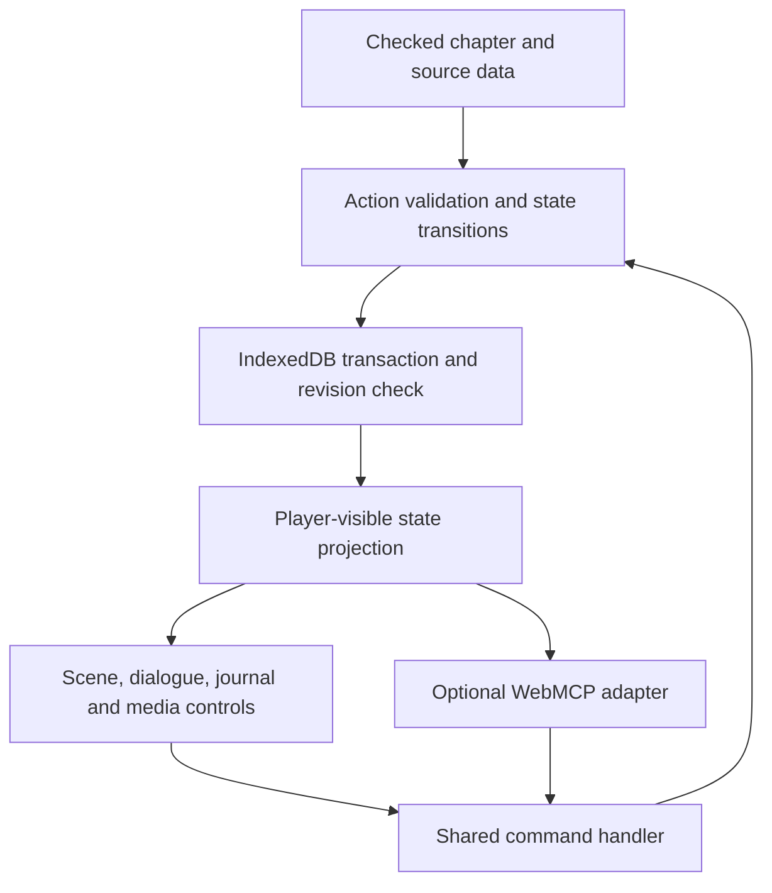
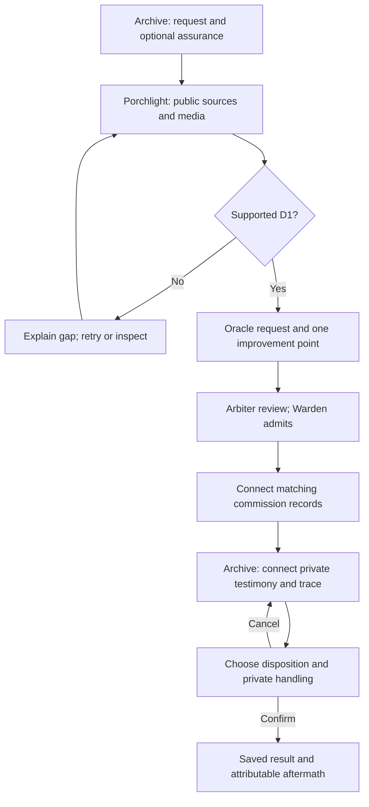
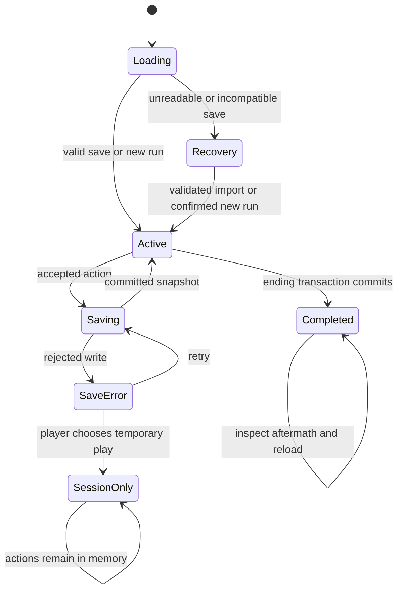

# The Network Mythos: Illustrated Mystery RPG - Plan

## Goal Capsule

**Objective:** Let a player investigate Mara's apparent return, develop their own approach as the Archivist, and reach an ending whose consequences they understand and can revisit.

**Means:** A browser-first, illustrated mystery adventure with light RPG progression. Build one complete short chapter before committing to a larger campaign. The target is approximately 15 minutes; pacing is a playtest question.

**Authority:** This plan governs the new illustrated adaptation. It supersedes the native plan's presentation and delivery assumptions for future development, while retaining its authored evidence and relationship rules where mapped below. The user approved this direction after comparing traditional RPGs, parser adventures and visual mysteries. This turn authorizes planning and saving; implementation and deployment are subsequent actions.

**History:** Preserve the Archive Hub, historical browser room, Windows encounter, published Godot preview and prior planning files. The illustrated work starts from the saved source at `aaf5d5a` on a separate `feat/illustrated-mystery` branch. The native and historical branches remain independently recoverable.

**Completion boundary:** The implementer owns code, source assets, verification and the reviewed GitHub checkpoint. The user and fresh players supply the human playtest evidence. Public sharing and automatic merging are not implied. A failure to complete, resume or understand the chapter stops expansion and triggers a focused correction.

---

## Product Contract

### Summary

Build a short adaptation of **Mara Vale: The Door Is Real** across four illustrated locations. Players inspect media, question people and powers, connect sources, develop an investigative ability, and choose Publish, Bury or Preserve. The final packet separately records how private context is handled.

### Problem Frame

The repository contains substantial narrative material and several presentation experiments. The latest browser export reached its startup-ready signal, but the user reported that it did not work. The cause remains undiagnosed; startup is insufficient evidence of playability.

The current opportunity is to make the characters, evidence and consequences enjoyable to interact with. The earlier native plan itself identified the risk of impressive spaces whose encounters reduce to reading menus. This adaptation concentrates on investigation, expressive avatars and remembered choices. A browser delivery failure alone does not establish that 3D was the wrong genre.

### Key Decisions

- **Visual mystery with RPG progression.** (session-settled: user-approved — chosen over a conventional combat-led RPG or typed-command adventure: give characters, evidence and choices the primary role.) Governs R1, R2, R5, R6.
- **Prove one complete short mystery first.** (session-settled: user-approved — chosen over immediate campaign expansion: assess whether investigating and deciding are enjoyable.) Governs R3, R9, R13.
- **Keep development history on GitHub.** (session-settled: user-directed — chosen over replacing or discarding prior experiments: retain visible progress and recoverable versions.) Governs R12.
- **Contemporary media must do investigative work.** (session-settled: user-approved — chosen over decorative social content: make replaying, comparing and tracing sources useful.) Governs R4, R7.

### Requirements

**World and agency**

- R1. Present locations as illustrated scenes with clear selectable actions and a revisitable map; all essential actions also appear as labelled controls.
- R2. Give the Oracle, Arbiter and Warden distinct appearances, functions and responses, while Rafi and Elian provide conflicting human stakes.
- R3. Provide an opening, three defensible discoveries, a final decision and a visible aftermath within one complete Mara chapter.
- R4. Require players to connect sources and select a supported explanation; collecting or watching material alone cannot establish a finding.
- R5. Let players choose an investigative emphasis and earn a meaningful improvement during the chapter; all starting choices retain access to essential evidence and every ending.
- R6. Remember promises and disclosure choices through attributable character responses; neither reputation nor a skill score changes the underlying truth.

**Evidence, presentation and endings**

- R7. Include a playable voice message, fictional vertical video and meme/repost chain, with captions, transcripts and image descriptions supporting the same claims.
- R8. Distinguish sources, interpretations, reconstructions and unknowns in the journal; copied material retains shared ancestry.
- R9. Offer all three dispositions and a separate private-context decision after the findings are established, with a preview, cancellation and destination-specific aftermath.
- R10. Allow comfortable keyboard, mouse and touch operation, text enlargement, reduced motion and play without sound; timed responses and camera control are unnecessary.

**Continuity and delivery**

- R11. Save consequential actions and resume them on the same browser; show an honest recovery route when saving fails or stored data is incompatible.
- R12. Keep the earlier builds, source assets and plans recoverable, with the illustrated game's saves and delivery separated from theirs.
- R13. Verify the published chapter through actual interactions, a complete ending and reload; a successful page load or automation status alone cannot satisfy release acceptance.
- R14. When the browser exposes WebMCP, allow tools to perform the same game actions against the same player-visible state and validation as the UI.

### Chapter Shape and Content Budget

The following is the proposed first-release allocation, bounded by assumptions A1-A4 below.

| Location | Dramatic purpose | Player action | Visible change |
|---|---|---|---|
| Archive | Rafi wants an answer; Elian asks for restraint. | Inspect the old recording, reply to Elian and choose an investigative emphasis. | The assurance is acknowledged; a lead becomes available. |
| Porchlight | A community welcomes a return before establishing what it proves. | Play the return clip, trace the meme, inspect summary and scope. | Source ancestry appears; an optional later correction changes the fictional feed. |
| Oracle | A coherent account conceals an evidential gap. | Present two sources and challenge the specific overclaim. | The Oracle acknowledges uncertainty and issues a bounded request. |
| Arbiter | Verification and access have different scopes. | Present that request, gain the Warden's admission and compare commission records. | Service evidence becomes accessible; the commissioned return is established. |
| Archive revisited | Knowledge creates responsibility. | Examine the private trace, connect D3, preview and commit the packet. | Elian and Rafi respond to what they can know; the Archive retains the result. |

Use the twelve representations in `docs/network-3d/content-register.md`: `mara.01`, `mara.03`, `mara.04`, `mara.05`, `mara.07`, `mara.08`, `mara.09.scope`, `mara.09.service`, `mara.10`, `mara.13`, `mara.14`, and `mara.meme`. They are a content budget, not a collectible quota. Six source representations supply the three core connections. Others supply personal context, framing or leads; optional reading must not silently become a gate.

Preserve the three discoveries from that register:

- D1: `mara.04` plus `mara.09.scope` establishes account authenticity without proving who operates it.
- D2: `mara.09.service` plus `mara.13`, carrying the same authored project identifier, establishes the commissioned reconstruction.
- D3: `mara.10` plus `mara.14` establishes a limited private lead and the risk of circulation, without proving Mara's present location.

The opening Elian exchange is newly authored dialogue addressed to the Archivist. Original artifact 10 remains a message to Rafi. This distinction and the fictional dates survive adaptation. Do not turn the kettle detail, vocal difference, avatar appearance or an invoice alone into proof.

The available roles are not a class-selection list. The player remains the Archivist. The full authoring registry survives in `docs/network-3d/roles.md`; the player journal reveals entries when useful. Covenant and Algorithm appear through community and circulation; Exchange through the commission. Remaining powers and persona categories belong to later cases. Constructs and Echoes stay unresolved.

### Key Flows

- F1. Start a new investigation, set reading preferences, choose an emphasis, receive Rafi's request and respond to Elian. Covers R1-R3, R5, R6, R10.
- F2. Inspect a scene, follow a media source, pin passages and present a supported connection. Rejected claims explain the gap and permit retry. Covers R4, R7, R8.
- F3. Carry the Oracle request into the Arbiter encounter, review permitted records, then return to the Archive for D3. Covers R2-R4, R6, R8.
- F4. Preview a fictional correction or final packet, inspect recipients and contents, cancel or commit, then observe the attributable response. Covers R6, R9.
- F5. Leave and return, resume the last committed action, or recover through a readable save/export route. Covers R11-R13.

### Acceptance Examples

- AE1. A player who skips audio and makes no assurance can establish all three findings and reach all six base endings. Covers R3-R7, R9, R10.
- AE2. Selecting two reposts of the same summary cannot establish D1; presenting summary plus scope in either order with the supported claim can. Covers R4, R8.
- AE3. An account badge alone cannot open the service review. The Oracle request authorizes the scoped Arbiter/Warden route. Covers R2, R4, R6.
- AE4. A promise followed by sealed inclusion is acknowledged as a broken inclusion promise, not a public leak. An earlier public D1 correction survives a later Bury ending. Covers R6, R9.
- AE5. Reloading after a finding, skill spend or ending does not duplicate rewards or lose the recorded choice. A failed write never displays “Saved.” Covers R5, R11.
- AE6. A direct visit to the published illustrated URL supports start, inspect, dialogue, findings, ending and resume without the local development server. Covers R12, R13.
- AE7. A browser tool sees only discovered evidence and currently available actions; an unavailable action is rejected exactly as the UI would reject it. Covers R8, R14.

### Scope Boundaries

This plan implements the first illustrated Mara chapter and its browser delivery. It retains the prior chapter's evidence and six base endings, with the 24 relationship/disclosure combinations composed from the existing authoring rules.

#### Deferred to Follow-Up Work

Full 3D movement, controller-specific navigation, a parser, a character creator, combat, inventory equipment, cloud accounts/sync, live AI dialogue, live social embeds, multiplayer, translations and the other three cases are outside this first build. Offline installation through a service worker is also deferred. The earlier native offline Windows build remains a separate artifact.

Campaign growth can add cases, locations, ability applications and relationships after the short chapter passes its playtest. No general quest editor, plugin system or arbitrary scripting language is required for one chapter.

---

## Planning Contract

### Assumptions

These are implementation defaults selected under the user's instruction to take the lead. They are not measurements or separately confirmed preferences.

- A1. Target roughly 15 minutes, allowing 12-20 minutes for the essential path and optional deeper reading. Test pacing; revise this target or trim presentation before expanding.
- A2. Prioritise current desktop Chrome/Edge and responsive touch layouts. Verify Firefox and WebKit too; claim named device support only when exercised on that device/browser.
- A3. Start three abilities at level 1 and let the player raise one to level 2: Observation, Interviewing and Systems. Award one improvement point once, after D1; spend it on one ability, capped at 3. No dice rolls, XP grind or stat respec is needed in this chapter.
- A4. Produce four location illustrations, five principal portraits with a small set of expressions, one Warden silhouette and the three media formats. The Warden can share the Arbiter scene. The Archivist uses a simple selectable insignia rather than a full avatar creator.
- A5. Suggested usability gate: the user completes one playthrough and at least two of three fresh players complete without facilitator rescue, explain the badge's limit, and name a cost of their ending. A need for rescue or a repeated misunderstanding requires correction. Recruitment happens with the user's involvement; no automated contact with other people.
- A6. Suggested delivery budget: first scene ready within five seconds on a recorded 10 Mbps/100 ms latency desktop test, initial transfer at most 3 MB, entire new chapter at most 25 MB. Media loads on request; budgets exclude the preserved Godot preview. Measure and report actual results.

### Key Technical Decisions

- KTD1. **Separate browser application.** Add `adventure/` using HTML, CSS and JavaScript ES modules with a small Node build/preview toolchain. Use semantic DOM controls for scenes, dialogue and the journal. This follows the repository's browser-native approach while separating the new state model from the legacy Hub. No WebAssembly or GPU renderer is required by the illustrated game. Governs R1, R10-R13.
- KTD2. **Authored content and one command path.** Store scenes, dialogue nodes, sources, claims and outcomes as checked JSON data. A pure state transition layer validates actions; both UI and browser tools use it. Use a finite vocabulary of conditions/effects, not evaluated strings, arbitrary scripts or a new story language. Governs R3-R9, R14.
- KTD3. **Facts and character growth stay separate.** Implement the proposed A3 progression as bounded abilities. Observation unlocks a comparison aid; Interviewing unlocks an additional witness exchange; Systems unlocks a scope explanation. Each level-2 option needs authored content, and each level-3 option adds a distinct optional follow-up. They never auto-complete D1-D3, alter source text or bypass an authority requirement. Governs R4-R6, R8.
- KTD4. **Versioned transactional saves.** Use IndexedDB for a small save envelope, not media storage. Track run ID, schema version, content version and revision. Validate and commit a command plus its resulting snapshot in one read/write transaction; resolve “Saved” only after transaction completion. Compare the expected revision within that transaction to reject stale-tab writes. See [IndexedDB guidance](https://developer.mozilla.org/en-US/docs/Web/API/IndexedDB_API/Using_IndexedDB). Governs R11.
- KTD5. **Explicit fictional disclosure.** Build packet previews from an allowlist of eligible findings and source references. Withholding excludes private originals and identifying derivatives, including caption text, labels and thumbnails. Bind confirmation to the run revision and preview digest. Repeating a commit returns the existing result; changed state requires a new preview. No game action contacts real recipients. Governs R6, R8, R9.
- KTD6. **Browser media with equivalent evidence.** Use user-triggered HTML audio/video, a broadly supported MP4 video rendition plus the existing WebM source, WebVTT captions and full transcripts. Only one item plays at a time; stop it when leaving the inspector or hiding the tab. Handle rejected playback promises and provide text immediately on failure. See [playback errors](https://developer.mozilla.org/en-US/docs/Web/API/HTMLMediaElement/play) and [caption support](https://developer.mozilla.org/en-US/docs/Web/Media/Guides/Audio_and_video_delivery/Adding_captions_and_subtitles_to_HTML5_video). Governs R7, R10.
- KTD7. **Add a route without replacing the preview.** Reuse the existing owner-private Sites project, `appgprj_6a9e73d7a004819193d310d7c7cff891`. Keep the current Godot root files intact and stage the new static app under `out/adventure/`. Use document-relative asset URLs so the same app runs locally and at `/adventure/`. No additional site creation or access change is required by this plan. Governs R12, R13.
- KTD8. **Test actual outcomes at both layers.** Use Node's test runner for rules/content validation and Playwright for browser interactions against the built static artifact. Define Chromium, Firefox and WebKit projects following [Playwright's project model](https://playwright.dev/docs/test-projects). Manual review covers story comprehension, visual composition and audible media; automated success cannot substitute. Governs R3-R14.
- KTD9. **Narrow browser tools with player context.** Expose read state, available actions and media equivalents, plus discrete navigation, inspection, dialogue, pinning, findings, ability spend, preview and commit commands. Use the same validation and save acknowledgement as the UI. Browser capability detection must leave ordinary play working when WebMCP is unavailable. No author-only canon or hidden ending classification appears in tool results. Governs R8, R11, R14.

### High-Level Technical Design

The snapshot includes current scene/dialogue, inspected sources, selected pins, findings, ability levels, the one-time reward/spend, assurance state, D1 post, packet result and discovered journal entries. Preserve unanswered, explicit non-promise and assurance separately. Store facts and decisions; derive available actions and character acknowledgements from them. Media playback is transient and resumes paused. Preferences are separate from investigation progress.

Content records carry stable IDs, source ancestry, access conditions, media equivalents and explicit recipient scope. Validate references and required media at build time. Render narrative text as text, with only trusted structural markup in templates. Never interpret imported save text as HTML or executable content. Client-delivered fiction is inspectable in source; hidden information is a gameplay boundary, not secure secrecy.

Scenes can be revisited. The optional public D1 post becomes available after D1 and remains independent of the ending. The diagram shows the essential route, not a prohibition on exploring earlier-accessible material.

Maintain the last known good save backup alongside the current snapshot in the same transaction. Export/import accepts a bounded JSON file with known versions, IDs and legal state combinations. A corrupt or future-version save is retained for export; never silently reset it. A new run replaces the active investigation only after a visible reset preview and confirmation. A stale tab becomes read-only until it reloads the newer revision. Rejected commands do not advance the revision.

In storage-denied or session-only mode, explain that progress will be lost on close and offer export. An ending may be shown as a temporary result, but cannot be labelled saved. Re-enabling durable saving must validate the current run against the stored revision before writing. No offline-reload guarantee is made without the deferred caching work.

### Experience and Art Direction

Aim for an illustrated cyberpunk mystery with warmth, humour and unease. The Archive uses worn materials and personal objects. Porchlight looks inviting but visibly edited. The Oracle uses incomplete arrangements and deliberate pauses. The Arbiter uses precise columns, seals and boundaries. Reuse a shared composition system while giving each place a readable silhouette and palette.

The scene occupies the main view; a compact objective and location label orient the player. Selecting a character opens portrait dialogue within the scene. The map and notebook remain one action away. Evidence opens in a readable inspector with source label, playback and equivalent text. On narrow screens, dialogue and evidence become full-width views with a labelled return action.

Do not fill the opening with a role encyclopedia, stat explanation or card grid. Let the player act within the opening exchange. Reveal relevant journal entries after encounters. Use short dialogue turns interrupted by actions; extended source text remains inspectable. Keep a persistent “Available here” list so hotspots are discoverable with keyboard and assistive technology.

Produce original imagery and editable masters; use existing media only where the asset register establishes provenance. Review generated art for consistency, expression and accidental text. Provisional voices must remain labelled in the asset register. The player should encounter fictional media inside the world without needing a TikTok account or live external service.

### Existing Work and Reuse

| Existing material | Reuse decision |
|---|---|
| `Case 001 - The Door Is Real/artifacts/` and original case design | Source authority; preserve originals and label adaptation additions. |
| `docs/network-3d/experience-bible.md`, `roles.md`, `content-register.md`, `canon-ledger.md`, `mara-beats.md` | Narrative authority for named facts, knowledge limits and ending composition; map changes in the new adaptation brief. |
| `game/scripts/proof_rules.gd` and `game/tests/test_proof_rules.gd` | Reference D1 and scoped access behaviour; port the rules with tests rather than loading Godot into the new app. |
| `Archive Hub/case-engine.js` | Reference source-based case configuration; do not extend its monolithic runtime for the illustrated game. |
| `Archive Hub/script.js` | Preserve legacy `network.archive.state` and all existing saves; the new app never reads, clears or migrates them. |
| `source-assets/native-proof/return.webm` and the asset register | Candidate provisional video master; produce browser renditions and verify the actual decoded result. |
| `docs/network-3d/web-preview.md` | Hosting identity and history. Record user-reported failure separately from prior startup evidence. |
| `docs/solutions/` | No learning directory was present in the inspected checkout; current reviews and proof records supply relevant lessons. |

A dedicated visual-novel engine, Ink runtime or React application would add a runtime or authoring system before this chapter requires one. The selected ES-module approach keeps custom source comparison and media controls direct. Reconsider authoring tooling only when repeated chapter work exposes a concrete cost; do not build a general engine first.

### Delivery and Preservation

The Site checkout retains its own `.openai/hosting.json` and configured static `out` directory. Copy the reviewed canonical `adventure/` source into that checkout, build its release into `out/adventure/`, and package the combined output through the Sites helper. Verify the old root asset hashes against the recorded Godot build manifest. If the original output is unavailable, recover the saved version or rebuild from its pinned source and verify it before staging; do not publish an incomplete replacement.

Commit and push the exact Site source snapshot used for the combined archive before saving a version. Retain the server-returned IDs and deployment status. Save the resulting source/asset hashes and route in `docs/illustrated-mystery/release-record.md`. Future rollback restores a prior compatible combined version; reverting to the original Godot-only version would remove `/adventure/` and must be described as withdrawal, not a transparent rollback.

The current proposed route is `https://enter-the-network.breadback00.chatgpt.site/adventure/`; it is not live at plan creation. Keep owner-private access. A build instruction alone does not authorize a later public audience change.

---

## Implementation Units

All requirement, assumption, flow, example and unit IDs are local to this plan. U-IDs do not refer to the earlier native U1-U13. Dependency order below is the implementation sequence. A reviewed unit should normally be one coherent commit; a substantial correction remains a separate commit under the same U-ID.

### U1. Author the short chapter and adaptation map

**Goal:** Establish the script, content budget, skill opportunities and visual brief before production.

**Requirements:** R2-R9, R12; assumptions A1, A3, A4.

**Dependencies:** None.

**Files:** Create `docs/illustrated-mystery/chapter-script.md`, `docs/illustrated-mystery/adaptation-map.md`, `docs/illustrated-mystery/art-direction.md`, `docs/illustrated-mystery/asset-register.md`.

**Approach:** Map all twelve source representations, D1-D3, each ability opportunity and the existing 24 ending combinations. Write opening, scene transitions and responses at the intended reading length. Keep original facts and newly authored dialogue distinguishable. Use the existing content register, canon ledger and recipient rules as patterns.

**Test expectation:** None for code; this is authored material. Perform an editorial walkthrough for each discovery and six base endings, then check the four relationship overlays per ending. Verify no required source is behind its own conclusion.

**Verification:** Every scene has an action, a change and a route onward; each ability level has a concrete optional use. The final art and media list has no unowned asset.

### U2. Establish the browser scene shell and static delivery

**Goal:** Open an illustrated location and navigate through usable controls in a normal browser.

**Requirements:** R1, R10, R12, R13.

**Dependencies:** U1.

**Files:** Create `adventure/package.json`, `adventure/package-lock.json`, `adventure/index.html`, `adventure/styles.css`, `adventure/src/main.js`, `adventure/src/ui/scene.js`, `adventure/tools/build.mjs`, `adventure/tools/preview.mjs`, `adventure/playwright.config.js`, `adventure/tests/e2e/shell.spec.js`, `adventure/README.md`, `adventure/AGENTS.md`.

**Approach:** Apply KTD1 and KTD7 to a representative scene. Pin a supported Node LTS and exact development-tool versions when installing; commit the lockfile. Set the static preview port to 4192. The build copies only declared assets and modules; it does not require SPA fallback routing. No production dependency is required.

**Test scenarios:**

1. A direct visit to both local root and a staged `/adventure/` path loads the scene and all action labels.
2. Keyboard traversal and a 390-pixel touch layout expose the same navigation without hidden essential hotspots.
3. A failed chapter-data request shows retry and does not leave an indefinite loading screen.

**Verification:** The first scene works from the built static directory with the source server absent. Confirm this before building the rest of the chapter.

### U3. Add validated state, saving and recovery

**Goal:** Make game actions and reloads preserve one consistent investigation.

**Requirements:** R11, R12; F5, AE5.

**Dependencies:** U2.

**Files:** Create `adventure/src/domain/state.js`, `adventure/src/domain/commands.js`, `adventure/src/domain/validation.js`, `adventure/src/storage/saves.js`, `adventure/src/ui/recovery.js`, `adventure/tests/unit/state.test.js`, `adventure/tests/e2e/saves.spec.js`.

**Approach:** Implement KTD2 and KTD4 with a dedicated database name `network.illustrated.mara`. Separate immutable command results from media/UI focus state. Define save export/import, backup recovery, session-only play, stale-tab handling and explicit new-run confirmation.

**Test scenarios:**

1. Covers AE5. Inspect and navigate, reload, and resume the exact committed scene and facts.
2. Two tabs submit against one revision; one succeeds and the stale writer cannot overwrite it.
3. A blocked transaction, unavailable storage or quota error shows unsaved state and preserves the prior valid save.
4. Corrupt, oversized and future-version imports are rejected without replacing current progress.
5. Reset/import cancellation keeps the current run; a confirmed new run affects only this app's database.

**Verification:** Real-browser IndexedDB tests prove commit acknowledgement and recovery, including preservation of seeded legacy Hub keys.

### U4. Implement dialogue, relationships and investigative growth

**Goal:** Make the Archivist's approach and earlier choices matter in conversations.

**Requirements:** R2, R5, R6, R8; F1, AE1, AE5.

**Dependencies:** U1, U3.

**Files:** Create `adventure/src/domain/dialogue.js`, `adventure/src/domain/progression.js`, `adventure/src/ui/dialogue.js`, `adventure/src/ui/abilities.js`, `adventure/content/mara/dialogue.json`, `adventure/tests/unit/dialogue.test.js`, `adventure/tests/unit/progression.test.js`, `adventure/tests/e2e/dialogue.spec.js`.

**Approach:** Implement the finite dialogue conditions and A3/KTD3. Keep witness knowledge scoped to authored receipts. Derive acknowledgements from decisions, not a universal friendship meter. Persist the reward and spend atomically through U3.

**Test scenarios:**

1. All three starting emphases retain the essential path; each enables its authored optional approach.
2. Covers AE5. Repeating D1 or reloading cannot award or spend the same point twice.
3. An unanswered Elian request remains unanswered; a later assurance records once and cannot be erased by revisiting.
4. A witness never discusses a sealed/private source absent a permitted notification.
5. A removed or invalid dialogue node returns safely to the scene without fabricating a choice.

**Verification:** Real dialogue buttons advance the same validated commands as the domain tests; players can observe the consequence of one skill choice.

### U5. Implement evidence, deductions and scoped encounters

**Goal:** Let players establish D1-D3 and experience the Oracle/Arbiter/Warden chain.

**Requirements:** R2-R4, R6, R8; F2, F3, AE2, AE3.

**Dependencies:** U3, U4.

**Files:** Create `adventure/src/domain/evidence.js`, `adventure/src/domain/encounters.js`, `adventure/src/ui/evidence.js`, `adventure/src/ui/notebook.js`, `adventure/content/mara/sources.json`, `adventure/content/mara/claims.json`, `adventure/tests/unit/evidence.test.js`, `adventure/tests/e2e/investigation.spec.js`.

**Approach:** Apply the content register's claim rules through KTD2. Keep inspect, pin and establish-finding separate. Provide a small authored explanation set and contextual feedback. Port the proven native D1 boundary, then implement D2/D3 from their authored source mappings.

**Test scenarios:**

1. Covers AE2. Source order does not matter; duplicate ancestry cannot satisfy a required independent connection.
2. Wrong death/reconstruction conclusions from D1 are rejected without consuming evidence or trapping progress.
3. Covers AE3. Presenting the badge fails; presenting the scoped request enables the permitted review.
4. D2 rejects an invoice without its service match; D3 rejects a precise-location claim.
5. Completing a finding updates the journal and scene response once; no hidden source becomes visible through a summary.

**Verification:** A keyboard-only playthrough establishes all findings using actual inspectors and explanation controls.

### U6. Produce the illustrated scenes, avatars and playable media

**Goal:** Give the short chapter a coherent visual identity and usable media evidence.

**Requirements:** R1, R2, R7, R10; F2, AE1.

**Dependencies:** U1, U2, U5.

**Files:** Create `adventure/assets/scenes/`, `adventure/assets/portraits/`, `adventure/assets/media/`, `source-assets/illustrated-mystery/`, `adventure/src/ui/media.js`, `adventure/tests/e2e/media.spec.js`; update `adventure/styles.css` and `docs/illustrated-mystery/asset-register.md`.

**Approach:** Produce A4's assets with original editable masters and caption/transcript equivalents. Apply KTD6. Use expressions and short motion to acknowledge decisions; a reduced-motion state carries equivalent meaning. Keep diagrams of evidence legible independently of colour.

**Test scenarios:**

1. Voice and video advance and seek in the tested browser; caption cues match the replayed passage.
2. Rejected playback, a missing rendition or muted sound leaves the full evidence available as text.
3. Leaving a scene, opening another recording or hiding the tab stops current playback; returning requires an explicit play action.
4. A meme crop and its source expose the contextual difference in both image and text routes.
5. Text enlargement to 200%, reduced motion and narrow layout preserve controls and dialogue focus.

**Verification:** Inspect the actual rendered scenes and decoded media. Record audible playback, caption timing, image descriptions, provenance and budget measurements; a visible poster does not count as video playback.

### U7. Commit the packet and compose remembered endings

**Goal:** Complete the investigation with a clear decision and persistent aftermath.

**Requirements:** R3, R6, R9, R11; F4, AE4, AE5.

**Dependencies:** U3-U5.

**Files:** Create `adventure/src/domain/ending.js`, `adventure/src/ui/packet.js`, `adventure/content/mara/endings.json`, `adventure/tests/unit/endings.test.js`, `adventure/tests/e2e/ending.spec.js`.

**Approach:** Implement KTD5 and the six base outcomes in `docs/network-3d/mara-beats.md`. Compose assurance and prior-post overlays without inventing witness knowledge. The ending button remains unavailable until the player understands the missing discovery requirements.

**Test scenarios:**

1. Covers AE4. Verify all 24 combinations and the sealed/restricted/public destination wording.
2. A withheld packet excludes private IDs and identifying derivatives from every rendered projection and notification.
3. Cancellation changes nothing; rapid repeated confirmation creates only one result.
4. A preview from a stale revision is rejected and regenerated before commitment.
5. Covers AE5. Reload shows the same ending; a failed write cannot claim durable completion.

**Verification:** Reach each of the six base endings through real controls across isolated runs, plus all 24 combinations through deterministic tests.

### U8. Assemble and pace the complete chapter

**Goal:** Connect the authored scenes, media, abilities and ending into one playable story.

**Requirements:** R1-R10; F1-F4, AE1.

**Dependencies:** U4-U7.

**Files:** Create `adventure/content/mara/chapter.json`, `adventure/content/mara/scenes.json`, `adventure/tests/unit/content.test.js`, `adventure/tests/e2e/chapter.spec.js`; update the U4/U5/U7 content files and `docs/illustrated-mystery/chapter-script.md`.

**Approach:** Integrate U1's script and source map. Provide objectives, revisit dialogue and layered hints: reminder, source nudge, explicit connection help on request. Preserve player selection of the final explanation. Add the Harbor Dawn lead as a closing hook without claiming another playable case.

**Test scenarios:**

1. Covers AE1. A new run reaches an ending without sound, optional skill dialogue or an assurance.
2. Revisiting a completed scene acknowledges progress and retains the route back.
3. Missing IDs, dead-end nodes, unregistered effects and unreachable essential sources fail content validation.
4. The player can pause mid-dialogue, reload and continue without repeating a consequential answer.
5. The objective and hint change after each finding; no hint reveals inaccessible private facts.

**Verification:** A complete unassisted internal playthrough records time, help use and comprehension gaps. Rewrite repetitive or confusing passages before adding more content.

### U9. Add browser-tool parity for the playable chapter

**Goal:** Let an agent operate the same investigation without a separate hidden game state.

**Requirements:** R8, R11, R14; AE7.

**Dependencies:** U3-U8.

**Files:** Create `adventure/src/agent/webmcp.js`, `adventure/tests/e2e/agent-parity.spec.js`; update `adventure/README.md`.

**Approach:** Apply KTD9 to U3's command handler. Tool results include the committed revision and visible outcome, not a premature success flag. Ending, fictional posting and reset use the same preview/confirm lifecycle as the UI. File import and browser permission prompts remain user-mediated; agents can export a validated save representation.

**Test scenarios:**

1. Covers AE7. UI and tool sequences produce equivalent visible state and saved revision.
2. Invalid IDs, extra arguments, unavailable choices and stale previews are rejected without mutation.
3. Undiscovered sources and author-only canon are absent from tool responses.
4. Storage failure returns unsaved/error status; reload refreshes tool registration without duplicates.
5. Browsers without WebMCP still complete the full chapter through the UI.

**Verification:** Exercise advertised tools in a browser that exposes them. A test-only mock validates schema logic but cannot establish live tool availability.

### U10. Verify usability, browser behaviour and recovery

**Goal:** Establish that the complete game is playable and comprehensible.

**Requirements:** R1-R14; AE1-AE7.

**Dependencies:** U8, U9.

**Files:** Create `docs/illustrated-mystery/playtest-protocol.md`, `docs/illustrated-mystery/verification-record.md`, `adventure/tests/e2e/release.spec.js`; correct affected implementation and scenario tests as findings require.

**Approach:** Apply KTD8 across the built artifact. Record exact browser versions, viewport, device, build identity and support gaps. Use the user playthrough and A5's fresh-player sessions to assess the story. Test the actual Codex in-app browser separately from browser automation.

**Test scenarios:**

1. Complete start-to-ending and reload on the supported browser matrix, including a keyboard-only and no-audio route.
2. Repeat save recovery, stale-tab and media-denial paths in real storage/media implementations.
3. Verify 390-pixel and desktop layouts, text zoom, focus restoration and reduced motion.
4. Measure A6's transfer/load targets against the built artifact with recorded conditions.

**Verification:** Publish a truthful record separating automated passes, direct observations, player reports and untested platforms. All blockers are corrected and retested. Missing human sessions leave the build labelled an internal preview.

### U11. Publish the separate illustrated route and preserve the record

**Goal:** Give the user a working online chapter without removing earlier developments.

**Requirements:** R11-R13; AE6.

**Dependencies:** U10; a subsequent instruction to build and publish this preview.

**Files:** Create `docs/illustrated-mystery/release-record.md` and `adventure/tools/stage-site.mjs`; update `README.md`, `docs/INDEX.md`, `adventure/README.md`. The selected Site checkout retains `.openai/hosting.json` and receives the canonical `adventure/` source.

**Approach:** Follow KTD7 and Delivery and Preservation. Stage only inside the declared static output. Keep the Godot files intact, package the combined output, save its exact pushed source state, and deploy to unchanged private access. Keep historical packages and branches; clean only abandoned new work from the active diff.

**Test scenarios:**

1. Covers AE6. The deployed `/adventure/` URL completes a real investigation and reloads its saved ending with local servers stopped.
2. Existing root assets retain their baseline hashes; no old archive or save key is removed.
3. A failed publish leaves the last successful version and the GitHub source checkpoint identifiable.
4. The public-facing handoff accurately describes access and support, and provides the new route rather than the old preview URL.

**Verification:** Record the final deployment outcome, browser playthrough and save resume on the published origin. Push the reviewed canonical changes. Report the real playable link and GitHub checkpoint; never infer either from a build exit code.

---

## Verification Contract

No new application tests or builds were run while writing this plan. Commands below are proposed package scripts established in U2, not existing passing checks.

| Evidence | Planned entry point / owner | Required result |
|---|---|---|
| Content and pure rules | `npm test` in `adventure/`; Node test runner | Valid references, fair D1-D3 gates, single reward/spend, all 24 ending combinations. |
| Static build | `npm run build` in `adventure/` | Declared release files, valid asset paths, content manifest and measured transfer sizes. |
| Browser integration | `npm run test:e2e` in `adventure/`; Playwright | Actual UI controls, IndexedDB, media and reload pass on named projects; report skipped browsers. |
| Art, sound and access | Implementer observation | Four coherent scenes, readable portraits, audible media, caption timing, keyboard/touch and text equivalents. |
| Story and agency | User plus fresh players | Record the A1/A5 pacing and comprehension observations; fix rescue points and repeated misunderstandings. |
| Published result | U11, exact deployed origin | Start-to-ending, save/resume and old-output preservation with development servers stopped. |

Stop the release on an unreachable essential clue, unsupported conclusion accepted as fact, incorrect disclosure destination, save loss presented as success, trapped input, missing equivalent evidence or failed published playthrough. Fix the observed cause and rerun the affected scenario. Passing unit tests alone does not clear this gate.

### Milestones

| Checkpoint | Units | What the user can assess |
|---|---|---|
| Browser foundation | U1-U3 | A representative illustrated scene opens, navigates and resumes. |
| Complete playable draft | U4-U8 | The entire mystery, progression and ending work together. |
| Reviewed preview | U9-U10 | Tool parity, browser coverage, art/media and human feedback are recorded. |
| Online handoff | U11 | A distinct playable URL with verified persistence and preserved history. |

These are dependency checkpoints, not calendar promises. Estimate remaining effort after the browser foundation and again after the complete draft, using actual work and playtest findings.

---

## Definition of Done

- All R1-R14 outcomes have traced evidence within their stated conditions. An internal preview may carry documented missing evidence, but that does not complete this plan or clear its expansion gate.
- The essential Mara route, each ability's optional contribution, six base endings and 24 response combinations behave as specified.
- Saving, recovery and session-only messaging are honest; legacy saves and preserved builds remain intact.
- The actual hosted chapter has been played to an ending and resumed. User-reported failure takes precedence over a startup-only success signal.
- The user playthrough and fresh-player gate are recorded before campaign expansion; recruitment remains pending until participants are available.
- Original assets, editable masters, equivalents, source provenance and current verification are saved on GitHub. Generated build outputs and credentials are excluded.
- No experimental new code or unused new assets are left in the active release. Historical artifacts required by R12 remain preserved.
- The handoff identifies what is playable, current access, tested browsers and unresolved limitations. No automatic merge or public audience change occurs.

---

## Sources and Research

Research checked on 7 September 2026. External guidance shaped KTD4, KTD6 and KTD8; it does not certify this unbuilt application.

- `docs/plans/2026-09-07-0140-feat-enter-the-network-plan.md`: previous native scope and relationship revision. Retained unchanged as history.
- `docs/network-3d/content-register.md`, `canon-ledger.md`, `roles.md`, `mara-beats.md`: facts, source ancestry, characters and endings retained by U1/U4/U5/U7.
- `docs/network-3d/asset-register.md` and `web-preview.md`: known media lineage, encoding lesson and limited startup evidence.
- `Archive Hub/case-engine.js`, `Archive Hub/script.js`, `ARCHITECTURE.md`: existing static browser pattern and legacy storage isolation requirement.
- [Disco Elysium: skill checks](https://discoelysium.com/devblog/2016/09/19/on-skill-checks): reference for abilities participating in dialogue; this plan uses deterministic authored options rather than adopting its dice system.
- [Citizen Sleeper](https://www.fellowtraveller.games/citizen-sleeper): reference for relationship-led narrative role-playing; no survival resource economy is imported.
- [MDN: IndexedDB](https://developer.mozilla.org/en-US/docs/Web/API/IndexedDB_API/Using_IndexedDB), [media playback](https://developer.mozilla.org/en-US/docs/Web/API/HTMLMediaElement/play), [captions](https://developer.mozilla.org/en-US/docs/Web/Media/Guides/Audio_and_video_delivery/Adding_captions_and_subtitles_to_HTML5_video): implementation authorities cited at their owning decisions.
- [Playwright projects](https://playwright.dev/docs/test-projects): browser-matrix structure, not a guarantee of actual-device coverage.
